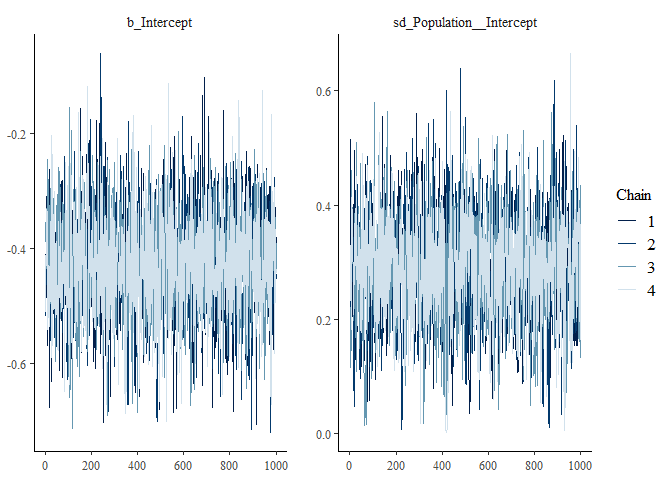
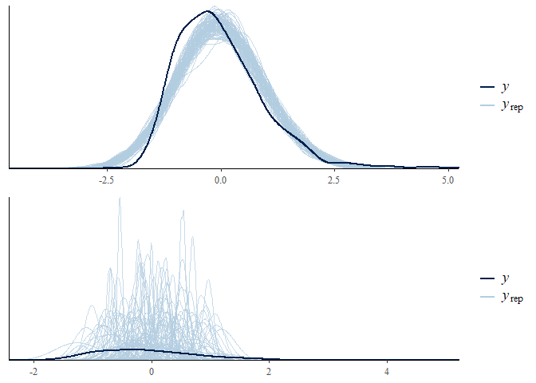

Assignment 4
------------

In this assignment we do the following: - we run a Bayesian
meta-analysis of pitch variability in ASD, based on previously published
literature - we analyze pitch variability in ASD in two new studies
using both a conservative and a meta-analytic prior - we assess the
difference in model quality and estimates using the two priors.

The questions you need to answer are: What are the consequences of using
a meta-analytic prior? Evaluate the models with conservative and
meta-analytic priors. Discuss the effects on estimates. Discuss the
effects on model quality. Discuss the role that meta-analytic priors
should have in scientific practice. Should we systematically use them?
Do they have drawbacks? Should we use them to complement more
conservative approaches? How does the use of meta-analytic priors you
suggest reflect the skeptical and cumulative nature of science?

``` r
#load data and packages

pacman::p_load(tidyverse, brms, metafor, bayesplot)

meta <- read_tsv("Ass4_MetaAnalysisData.tsv")
```

    ## Parsed with column specification:
    ## cols(
    ##   .default = col_double(),
    ##   Paper = col_character(),
    ##   Author = col_character(),
    ##   Population = col_character(),
    ##   DiagnosisDetails = col_character(),
    ##   Language = col_character(),
    ##   Language2 = col_character(),
    ##   Task = col_character(),
    ##   Task2 = col_character(),
    ##   PitchMean_Units = col_character(),
    ##   PitchMeanASDvsTD = col_character(),
    ##   PitchRange_Units = col_character(),
    ##   PitchRangeASDvsTD = col_character(),
    ##   PitchSD_Units = col_character(),
    ##   PitchSDASDvsTD = col_character(),
    ##   PitchVariability_Units = col_character(),
    ##   PitchVariabilityASDvsTD = col_character(),
    ##   IntensityMean_Units = col_character(),
    ##   IntensityMeanASDvsTD = col_character(),
    ##   UtteranceDurationUnit = col_character(),
    ##   UtteranceDurationASDvsTD = col_character()
    ##   # ... with 5 more columns
    ## )

    ## See spec(...) for full column specifications.

``` r
#remove NA's
meta <- meta[complete.cases(meta[,38:41]),]

full <- read_csv("Ass4_data.csv")
```

    ## Parsed with column specification:
    ## cols(
    ##   .default = col_double(),
    ##   Language = col_character(),
    ##   Diagnosis = col_character(),
    ##   Gender = col_character(),
    ##   AdosCommunication = col_character(),
    ##   AdosSocial = col_character(),
    ##   AdosCreativity = col_character(),
    ##   AdosStereotyped = col_character(),
    ##   language = col_character()
    ## )
    ## See spec(...) for full column specifications.

    ## Warning: 32 parsing failures.
    ##  row col expected actual            file
    ## 1043  ID a double    ALY 'Ass4_data.csv'
    ## 1044  ID a double    ALY 'Ass4_data.csv'
    ## 1045  ID a double    ALY 'Ass4_data.csv'
    ## 1046  ID a double    ANS 'Ass4_data.csv'
    ## 1047  ID a double    ANS 'Ass4_data.csv'
    ## .... ... ........ ...... ...............
    ## See problems(...) for more details.

### Step by step suggestions

Step 1: Perform a meta-analysis of pitch variability from previous
studies of voice in ASD - the data is available as
Ass4\_MetaAnalysisData.tsv - You should calculate Effect size (cohen’s
d) and Standard Error (uncertainty in the Cohen’s d) per each study,
using escalc() from the metafor package (also check the livecoding
intro) - N.B. we’re only interested in getting a meta-analytic effect
size for the meta-analytic prior (and not e.g. all the stuff on
publication bias). See a brms tutorial here:
<a href="https://vuorre.netlify.com/post/2016/09/29/meta-analysis-is-a-special-case-of-bayesian-multilevel-modeling/" class="uri">https://vuorre.netlify.com/post/2016/09/29/meta-analysis-is-a-special-case-of-bayesian-multilevel-modeling/</a>
The formula is EffectSize \| se(StandardError) \~ 1 + (1 \| Paper).
Don’t forget prior definition, model checking, etc. - Write down the
results of the meta-analysis in terms of a prior for step 2.

``` r
#meta analysis
meta <- escalc(measure = "SMD",
       n1i = TD_N,
       n2i = ASD_N,
       m1i = PitchVariabilityTD_Mean,
       m2i = PitchVariabilityASD_Mean,
       sd1i = PitchVariabilityTD_SD,
       sd2i = PitchVariabilityASD_SD,
       data = meta,
       slab = Paper)

#rename variables
meta <- meta %>% mutate(StandardError = sqrt(vi)) %>% 
  rename(EffectSize = yi)

#get priors for model
get_prior(formula = EffectSize | se(StandardError) ~ 1 + (1 | Population),
          data = meta,
          family = gaussian())
```

    ##                  prior     class      coef      group resp dpar nlpar
    ## 1 student_t(3, -1, 10) Intercept                                     
    ## 2  student_t(3, 0, 10)        sd                                     
    ## 3                             sd           Population                
    ## 4                             sd Intercept Population                
    ##   bound
    ## 1      
    ## 2      
    ## 3      
    ## 4

``` r
#plot distribution of effect size
meta %>% 
  ggplot(aes(EffectSize)) + 
  geom_density()
```


``` r
#distribution summary
summary(meta$EffectSize)
```

    ##     Min.  1st Qu.   Median     Mean  3rd Qu.     Max. 
    ## -1.29110 -0.81658 -0.65338 -0.46315 -0.05907  0.52031

``` r
#model the prior 
meta_model_prior <- brm(
  formula = EffectSize | se(StandardError) ~ 1 + (1 | Population),
  data = meta,
  family = gaussian(),
  prior = c(
    prior(normal(0,1), class = Intercept),
    prior(normal(0, .3), class = sd)),
  sample_prior = "only",
  control = list(adapt_delta = .99)
  )
```

    ## Compiling the C++ model

    ## Start sampling

    ## 
    ## SAMPLING FOR MODEL '0f1dbeafc80a8b4214d5e6ea0e02f0b8' NOW (CHAIN 1).
    ## Chain 1: 
    ## Chain 1: Gradient evaluation took 0 seconds
    ## Chain 1: 1000 transitions using 10 leapfrog steps per transition would take 0 seconds.
    ## Chain 1: Adjust your expectations accordingly!
    ## Chain 1: 
    ## Chain 1: 
    ## Chain 1: Iteration:    1 / 2000 [  0%]  (Warmup)
    ## Chain 1: Iteration:  200 / 2000 [ 10%]  (Warmup)
    ## Chain 1: Iteration:  400 / 2000 [ 20%]  (Warmup)
    ## Chain 1: Iteration:  600 / 2000 [ 30%]  (Warmup)
    ## Chain 1: Iteration:  800 / 2000 [ 40%]  (Warmup)
    ## Chain 1: Iteration: 1000 / 2000 [ 50%]  (Warmup)
    ## Chain 1: Iteration: 1001 / 2000 [ 50%]  (Sampling)
    ## Chain 1: Iteration: 1200 / 2000 [ 60%]  (Sampling)
    ## Chain 1: Iteration: 1400 / 2000 [ 70%]  (Sampling)
    ## Chain 1: Iteration: 1600 / 2000 [ 80%]  (Sampling)
    ## Chain 1: Iteration: 1800 / 2000 [ 90%]  (Sampling)
    ## Chain 1: Iteration: 2000 / 2000 [100%]  (Sampling)
    ## Chain 1: 
    ## Chain 1:  Elapsed Time: 0.157 seconds (Warm-up)
    ## Chain 1:                0.166 seconds (Sampling)
    ## Chain 1:                0.323 seconds (Total)
    ## Chain 1: 
    ## 
    ## SAMPLING FOR MODEL '0f1dbeafc80a8b4214d5e6ea0e02f0b8' NOW (CHAIN 2).
    ## Chain 2: 
    ## Chain 2: Gradient evaluation took 0 seconds
    ## Chain 2: 1000 transitions using 10 leapfrog steps per transition would take 0 seconds.
    ## Chain 2: Adjust your expectations accordingly!
    ## Chain 2: 
    ## Chain 2: 
    ## Chain 2: Iteration:    1 / 2000 [  0%]  (Warmup)
    ## Chain 2: Iteration:  200 / 2000 [ 10%]  (Warmup)
    ## Chain 2: Iteration:  400 / 2000 [ 20%]  (Warmup)
    ## Chain 2: Iteration:  600 / 2000 [ 30%]  (Warmup)
    ## Chain 2: Iteration:  800 / 2000 [ 40%]  (Warmup)
    ## Chain 2: Iteration: 1000 / 2000 [ 50%]  (Warmup)
    ## Chain 2: Iteration: 1001 / 2000 [ 50%]  (Sampling)
    ## Chain 2: Iteration: 1200 / 2000 [ 60%]  (Sampling)
    ## Chain 2: Iteration: 1400 / 2000 [ 70%]  (Sampling)
    ## Chain 2: Iteration: 1600 / 2000 [ 80%]  (Sampling)
    ## Chain 2: Iteration: 1800 / 2000 [ 90%]  (Sampling)
    ## Chain 2: Iteration: 2000 / 2000 [100%]  (Sampling)
    ## Chain 2: 
    ## Chain 2:  Elapsed Time: 0.146 seconds (Warm-up)
    ## Chain 2:                0.168 seconds (Sampling)
    ## Chain 2:                0.314 seconds (Total)
    ## Chain 2: 
    ## 
    ## SAMPLING FOR MODEL '0f1dbeafc80a8b4214d5e6ea0e02f0b8' NOW (CHAIN 3).
    ## Chain 3: 
    ## Chain 3: Gradient evaluation took 0 seconds
    ## Chain 3: 1000 transitions using 10 leapfrog steps per transition would take 0 seconds.
    ## Chain 3: Adjust your expectations accordingly!
    ## Chain 3: 
    ## Chain 3: 
    ## Chain 3: Iteration:    1 / 2000 [  0%]  (Warmup)
    ## Chain 3: Iteration:  200 / 2000 [ 10%]  (Warmup)
    ## Chain 3: Iteration:  400 / 2000 [ 20%]  (Warmup)
    ## Chain 3: Iteration:  600 / 2000 [ 30%]  (Warmup)
    ## Chain 3: Iteration:  800 / 2000 [ 40%]  (Warmup)
    ## Chain 3: Iteration: 1000 / 2000 [ 50%]  (Warmup)
    ## Chain 3: Iteration: 1001 / 2000 [ 50%]  (Sampling)
    ## Chain 3: Iteration: 1200 / 2000 [ 60%]  (Sampling)
    ## Chain 3: Iteration: 1400 / 2000 [ 70%]  (Sampling)
    ## Chain 3: Iteration: 1600 / 2000 [ 80%]  (Sampling)
    ## Chain 3: Iteration: 1800 / 2000 [ 90%]  (Sampling)
    ## Chain 3: Iteration: 2000 / 2000 [100%]  (Sampling)
    ## Chain 3: 
    ## Chain 3:  Elapsed Time: 0.16 seconds (Warm-up)
    ## Chain 3:                0.17 seconds (Sampling)
    ## Chain 3:                0.33 seconds (Total)
    ## Chain 3: 
    ## 
    ## SAMPLING FOR MODEL '0f1dbeafc80a8b4214d5e6ea0e02f0b8' NOW (CHAIN 4).
    ## Chain 4: 
    ## Chain 4: Gradient evaluation took 0 seconds
    ## Chain 4: 1000 transitions using 10 leapfrog steps per transition would take 0 seconds.
    ## Chain 4: Adjust your expectations accordingly!
    ## Chain 4: 
    ## Chain 4: 
    ## Chain 4: Iteration:    1 / 2000 [  0%]  (Warmup)
    ## Chain 4: Iteration:  200 / 2000 [ 10%]  (Warmup)
    ## Chain 4: Iteration:  400 / 2000 [ 20%]  (Warmup)
    ## Chain 4: Iteration:  600 / 2000 [ 30%]  (Warmup)
    ## Chain 4: Iteration:  800 / 2000 [ 40%]  (Warmup)
    ## Chain 4: Iteration: 1000 / 2000 [ 50%]  (Warmup)
    ## Chain 4: Iteration: 1001 / 2000 [ 50%]  (Sampling)
    ## Chain 4: Iteration: 1200 / 2000 [ 60%]  (Sampling)
    ## Chain 4: Iteration: 1400 / 2000 [ 70%]  (Sampling)
    ## Chain 4: Iteration: 1600 / 2000 [ 80%]  (Sampling)
    ## Chain 4: Iteration: 1800 / 2000 [ 90%]  (Sampling)
    ## Chain 4: Iteration: 2000 / 2000 [100%]  (Sampling)
    ## Chain 4: 
    ## Chain 4:  Elapsed Time: 0.15 seconds (Warm-up)
    ## Chain 4:                0.136 seconds (Sampling)
    ## Chain 4:                0.286 seconds (Total)
    ## Chain 4:

``` r
#Prior predictive check
(meta_1st_prior <- pp_check(meta_model_prior, nsamples = 100))
```


``` r
#model prior again 
meta_model_prior <- brm(
  formula = EffectSize | se(StandardError) ~ 1 + (1 | Population),
  data = meta,
  family = gaussian(),
  prior = c(
    prior(normal(0,1), class = Intercept),
    prior(normal(0, .2), class = sd)),
  sample_prior = "only",
  control = list(adapt_delta = .99)
  )
```

    ## Compiling the C++ model
    ## Start sampling

    ## 
    ## SAMPLING FOR MODEL '4d3d0a0d672eabe6b26a403d51f33f3c' NOW (CHAIN 1).
    ## Chain 1: 
    ## Chain 1: Gradient evaluation took 0 seconds
    ## Chain 1: 1000 transitions using 10 leapfrog steps per transition would take 0 seconds.
    ## Chain 1: Adjust your expectations accordingly!
    ## Chain 1: 
    ## Chain 1: 
    ## Chain 1: Iteration:    1 / 2000 [  0%]  (Warmup)
    ## Chain 1: Iteration:  200 / 2000 [ 10%]  (Warmup)
    ## Chain 1: Iteration:  400 / 2000 [ 20%]  (Warmup)
    ## Chain 1: Iteration:  600 / 2000 [ 30%]  (Warmup)
    ## Chain 1: Iteration:  800 / 2000 [ 40%]  (Warmup)
    ## Chain 1: Iteration: 1000 / 2000 [ 50%]  (Warmup)
    ## Chain 1: Iteration: 1001 / 2000 [ 50%]  (Sampling)
    ## Chain 1: Iteration: 1200 / 2000 [ 60%]  (Sampling)
    ## Chain 1: Iteration: 1400 / 2000 [ 70%]  (Sampling)
    ## Chain 1: Iteration: 1600 / 2000 [ 80%]  (Sampling)
    ## Chain 1: Iteration: 1800 / 2000 [ 90%]  (Sampling)
    ## Chain 1: Iteration: 2000 / 2000 [100%]  (Sampling)
    ## Chain 1: 
    ## Chain 1:  Elapsed Time: 0.165 seconds (Warm-up)
    ## Chain 1:                0.172 seconds (Sampling)
    ## Chain 1:                0.337 seconds (Total)
    ## Chain 1: 
    ## 
    ## SAMPLING FOR MODEL '4d3d0a0d672eabe6b26a403d51f33f3c' NOW (CHAIN 2).
    ## Chain 2: 
    ## Chain 2: Gradient evaluation took 0 seconds
    ## Chain 2: 1000 transitions using 10 leapfrog steps per transition would take 0 seconds.
    ## Chain 2: Adjust your expectations accordingly!
    ## Chain 2: 
    ## Chain 2: 
    ## Chain 2: Iteration:    1 / 2000 [  0%]  (Warmup)
    ## Chain 2: Iteration:  200 / 2000 [ 10%]  (Warmup)
    ## Chain 2: Iteration:  400 / 2000 [ 20%]  (Warmup)
    ## Chain 2: Iteration:  600 / 2000 [ 30%]  (Warmup)
    ## Chain 2: Iteration:  800 / 2000 [ 40%]  (Warmup)
    ## Chain 2: Iteration: 1000 / 2000 [ 50%]  (Warmup)
    ## Chain 2: Iteration: 1001 / 2000 [ 50%]  (Sampling)
    ## Chain 2: Iteration: 1200 / 2000 [ 60%]  (Sampling)
    ## Chain 2: Iteration: 1400 / 2000 [ 70%]  (Sampling)
    ## Chain 2: Iteration: 1600 / 2000 [ 80%]  (Sampling)
    ## Chain 2: Iteration: 1800 / 2000 [ 90%]  (Sampling)
    ## Chain 2: Iteration: 2000 / 2000 [100%]  (Sampling)
    ## Chain 2: 
    ## Chain 2:  Elapsed Time: 0.141 seconds (Warm-up)
    ## Chain 2:                0.176 seconds (Sampling)
    ## Chain 2:                0.317 seconds (Total)
    ## Chain 2: 
    ## 
    ## SAMPLING FOR MODEL '4d3d0a0d672eabe6b26a403d51f33f3c' NOW (CHAIN 3).
    ## Chain 3: 
    ## Chain 3: Gradient evaluation took 0 seconds
    ## Chain 3: 1000 transitions using 10 leapfrog steps per transition would take 0 seconds.
    ## Chain 3: Adjust your expectations accordingly!
    ## Chain 3: 
    ## Chain 3: 
    ## Chain 3: Iteration:    1 / 2000 [  0%]  (Warmup)
    ## Chain 3: Iteration:  200 / 2000 [ 10%]  (Warmup)
    ## Chain 3: Iteration:  400 / 2000 [ 20%]  (Warmup)
    ## Chain 3: Iteration:  600 / 2000 [ 30%]  (Warmup)
    ## Chain 3: Iteration:  800 / 2000 [ 40%]  (Warmup)
    ## Chain 3: Iteration: 1000 / 2000 [ 50%]  (Warmup)
    ## Chain 3: Iteration: 1001 / 2000 [ 50%]  (Sampling)
    ## Chain 3: Iteration: 1200 / 2000 [ 60%]  (Sampling)
    ## Chain 3: Iteration: 1400 / 2000 [ 70%]  (Sampling)
    ## Chain 3: Iteration: 1600 / 2000 [ 80%]  (Sampling)
    ## Chain 3: Iteration: 1800 / 2000 [ 90%]  (Sampling)
    ## Chain 3: Iteration: 2000 / 2000 [100%]  (Sampling)
    ## Chain 3: 
    ## Chain 3:  Elapsed Time: 0.177 seconds (Warm-up)
    ## Chain 3:                0.175 seconds (Sampling)
    ## Chain 3:                0.352 seconds (Total)
    ## Chain 3: 
    ## 
    ## SAMPLING FOR MODEL '4d3d0a0d672eabe6b26a403d51f33f3c' NOW (CHAIN 4).
    ## Chain 4: 
    ## Chain 4: Gradient evaluation took 0 seconds
    ## Chain 4: 1000 transitions using 10 leapfrog steps per transition would take 0 seconds.
    ## Chain 4: Adjust your expectations accordingly!
    ## Chain 4: 
    ## Chain 4: 
    ## Chain 4: Iteration:    1 / 2000 [  0%]  (Warmup)
    ## Chain 4: Iteration:  200 / 2000 [ 10%]  (Warmup)
    ## Chain 4: Iteration:  400 / 2000 [ 20%]  (Warmup)
    ## Chain 4: Iteration:  600 / 2000 [ 30%]  (Warmup)
    ## Chain 4: Iteration:  800 / 2000 [ 40%]  (Warmup)
    ## Chain 4: Iteration: 1000 / 2000 [ 50%]  (Warmup)
    ## Chain 4: Iteration: 1001 / 2000 [ 50%]  (Sampling)
    ## Chain 4: Iteration: 1200 / 2000 [ 60%]  (Sampling)
    ## Chain 4: Iteration: 1400 / 2000 [ 70%]  (Sampling)
    ## Chain 4: Iteration: 1600 / 2000 [ 80%]  (Sampling)
    ## Chain 4: Iteration: 1800 / 2000 [ 90%]  (Sampling)
    ## Chain 4: Iteration: 2000 / 2000 [100%]  (Sampling)
    ## Chain 4: 
    ## Chain 4:  Elapsed Time: 0.178 seconds (Warm-up)
    ## Chain 4:                0.177 seconds (Sampling)
    ## Chain 4:                0.355 seconds (Total)
    ## Chain 4:

``` r
#Second prior predictive check
(meta_2nd_prior <- pp_check(meta_model_prior, nsamples = 100))
```


``` r
#model prior again, again
meta_model_prior <- brm(
  formula = EffectSize | se(StandardError) ~ 1 + (1 | Population),
  data = meta,
  family = gaussian(),
  prior = c(
    prior(normal(0,.5), class = Intercept),
    prior(normal(0, .2), class = sd)),
  sample_prior = "only",
  control = list(adapt_delta = .99)
  )
```

    ## Compiling the C++ model
    ## Start sampling

    ## 
    ## SAMPLING FOR MODEL 'e3d07998a4711ed2b3fa2140bc2f39f9' NOW (CHAIN 1).
    ## Chain 1: 
    ## Chain 1: Gradient evaluation took 0 seconds
    ## Chain 1: 1000 transitions using 10 leapfrog steps per transition would take 0 seconds.
    ## Chain 1: Adjust your expectations accordingly!
    ## Chain 1: 
    ## Chain 1: 
    ## Chain 1: Iteration:    1 / 2000 [  0%]  (Warmup)
    ## Chain 1: Iteration:  200 / 2000 [ 10%]  (Warmup)
    ## Chain 1: Iteration:  400 / 2000 [ 20%]  (Warmup)
    ## Chain 1: Iteration:  600 / 2000 [ 30%]  (Warmup)
    ## Chain 1: Iteration:  800 / 2000 [ 40%]  (Warmup)
    ## Chain 1: Iteration: 1000 / 2000 [ 50%]  (Warmup)
    ## Chain 1: Iteration: 1001 / 2000 [ 50%]  (Sampling)
    ## Chain 1: Iteration: 1200 / 2000 [ 60%]  (Sampling)
    ## Chain 1: Iteration: 1400 / 2000 [ 70%]  (Sampling)
    ## Chain 1: Iteration: 1600 / 2000 [ 80%]  (Sampling)
    ## Chain 1: Iteration: 1800 / 2000 [ 90%]  (Sampling)
    ## Chain 1: Iteration: 2000 / 2000 [100%]  (Sampling)
    ## Chain 1: 
    ## Chain 1:  Elapsed Time: 0.182 seconds (Warm-up)
    ## Chain 1:                0.178 seconds (Sampling)
    ## Chain 1:                0.36 seconds (Total)
    ## Chain 1: 
    ## 
    ## SAMPLING FOR MODEL 'e3d07998a4711ed2b3fa2140bc2f39f9' NOW (CHAIN 2).
    ## Chain 2: 
    ## Chain 2: Gradient evaluation took 0.001 seconds
    ## Chain 2: 1000 transitions using 10 leapfrog steps per transition would take 10 seconds.
    ## Chain 2: Adjust your expectations accordingly!
    ## Chain 2: 
    ## Chain 2: 
    ## Chain 2: Iteration:    1 / 2000 [  0%]  (Warmup)
    ## Chain 2: Iteration:  200 / 2000 [ 10%]  (Warmup)
    ## Chain 2: Iteration:  400 / 2000 [ 20%]  (Warmup)
    ## Chain 2: Iteration:  600 / 2000 [ 30%]  (Warmup)
    ## Chain 2: Iteration:  800 / 2000 [ 40%]  (Warmup)
    ## Chain 2: Iteration: 1000 / 2000 [ 50%]  (Warmup)
    ## Chain 2: Iteration: 1001 / 2000 [ 50%]  (Sampling)
    ## Chain 2: Iteration: 1200 / 2000 [ 60%]  (Sampling)
    ## Chain 2: Iteration: 1400 / 2000 [ 70%]  (Sampling)
    ## Chain 2: Iteration: 1600 / 2000 [ 80%]  (Sampling)
    ## Chain 2: Iteration: 1800 / 2000 [ 90%]  (Sampling)
    ## Chain 2: Iteration: 2000 / 2000 [100%]  (Sampling)
    ## Chain 2: 
    ## Chain 2:  Elapsed Time: 0.178 seconds (Warm-up)
    ## Chain 2:                0.181 seconds (Sampling)
    ## Chain 2:                0.359 seconds (Total)
    ## Chain 2: 
    ## 
    ## SAMPLING FOR MODEL 'e3d07998a4711ed2b3fa2140bc2f39f9' NOW (CHAIN 3).
    ## Chain 3: 
    ## Chain 3: Gradient evaluation took 0 seconds
    ## Chain 3: 1000 transitions using 10 leapfrog steps per transition would take 0 seconds.
    ## Chain 3: Adjust your expectations accordingly!
    ## Chain 3: 
    ## Chain 3: 
    ## Chain 3: Iteration:    1 / 2000 [  0%]  (Warmup)
    ## Chain 3: Iteration:  200 / 2000 [ 10%]  (Warmup)
    ## Chain 3: Iteration:  400 / 2000 [ 20%]  (Warmup)
    ## Chain 3: Iteration:  600 / 2000 [ 30%]  (Warmup)
    ## Chain 3: Iteration:  800 / 2000 [ 40%]  (Warmup)
    ## Chain 3: Iteration: 1000 / 2000 [ 50%]  (Warmup)
    ## Chain 3: Iteration: 1001 / 2000 [ 50%]  (Sampling)
    ## Chain 3: Iteration: 1200 / 2000 [ 60%]  (Sampling)
    ## Chain 3: Iteration: 1400 / 2000 [ 70%]  (Sampling)
    ## Chain 3: Iteration: 1600 / 2000 [ 80%]  (Sampling)
    ## Chain 3: Iteration: 1800 / 2000 [ 90%]  (Sampling)
    ## Chain 3: Iteration: 2000 / 2000 [100%]  (Sampling)
    ## Chain 3: 
    ## Chain 3:  Elapsed Time: 0.166 seconds (Warm-up)
    ## Chain 3:                0.139 seconds (Sampling)
    ## Chain 3:                0.305 seconds (Total)
    ## Chain 3: 
    ## 
    ## SAMPLING FOR MODEL 'e3d07998a4711ed2b3fa2140bc2f39f9' NOW (CHAIN 4).
    ## Chain 4: 
    ## Chain 4: Gradient evaluation took 0 seconds
    ## Chain 4: 1000 transitions using 10 leapfrog steps per transition would take 0 seconds.
    ## Chain 4: Adjust your expectations accordingly!
    ## Chain 4: 
    ## Chain 4: 
    ## Chain 4: Iteration:    1 / 2000 [  0%]  (Warmup)
    ## Chain 4: Iteration:  200 / 2000 [ 10%]  (Warmup)
    ## Chain 4: Iteration:  400 / 2000 [ 20%]  (Warmup)
    ## Chain 4: Iteration:  600 / 2000 [ 30%]  (Warmup)
    ## Chain 4: Iteration:  800 / 2000 [ 40%]  (Warmup)
    ## Chain 4: Iteration: 1000 / 2000 [ 50%]  (Warmup)
    ## Chain 4: Iteration: 1001 / 2000 [ 50%]  (Sampling)
    ## Chain 4: Iteration: 1200 / 2000 [ 60%]  (Sampling)
    ## Chain 4: Iteration: 1400 / 2000 [ 70%]  (Sampling)
    ## Chain 4: Iteration: 1600 / 2000 [ 80%]  (Sampling)
    ## Chain 4: Iteration: 1800 / 2000 [ 90%]  (Sampling)
    ## Chain 4: Iteration: 2000 / 2000 [100%]  (Sampling)
    ## Chain 4: 
    ## Chain 4:  Elapsed Time: 0.191 seconds (Warm-up)
    ## Chain 4:                0.184 seconds (Sampling)
    ## Chain 4:                0.375 seconds (Total)
    ## Chain 4:

``` r
#Final prior predictive check  
(meta_3rd_prior <- pp_check(meta_model_prior, nsamples = 100))
```


``` r
#Model posterior
meta_model_posterior <- brm(
  formula = EffectSize | se(StandardError) ~ 1 + (1 | Population),
  data = meta,
  family = gaussian(),
  prior = c(
    prior(normal(0,.5), class = Intercept),
    prior(normal(0, .2), class = sd)),
  control = list(adapt_delta = .99)
  )
```

    ## Compiling the C++ model

    ## recompiling to avoid crashing R session

    ## Start sampling

    ## 
    ## SAMPLING FOR MODEL 'e3d07998a4711ed2b3fa2140bc2f39f9' NOW (CHAIN 1).
    ## Chain 1: 
    ## Chain 1: Gradient evaluation took 0 seconds
    ## Chain 1: 1000 transitions using 10 leapfrog steps per transition would take 0 seconds.
    ## Chain 1: Adjust your expectations accordingly!
    ## Chain 1: 
    ## Chain 1: 
    ## Chain 1: Iteration:    1 / 2000 [  0%]  (Warmup)
    ## Chain 1: Iteration:  200 / 2000 [ 10%]  (Warmup)
    ## Chain 1: Iteration:  400 / 2000 [ 20%]  (Warmup)
    ## Chain 1: Iteration:  600 / 2000 [ 30%]  (Warmup)
    ## Chain 1: Iteration:  800 / 2000 [ 40%]  (Warmup)
    ## Chain 1: Iteration: 1000 / 2000 [ 50%]  (Warmup)
    ## Chain 1: Iteration: 1001 / 2000 [ 50%]  (Sampling)
    ## Chain 1: Iteration: 1200 / 2000 [ 60%]  (Sampling)
    ## Chain 1: Iteration: 1400 / 2000 [ 70%]  (Sampling)
    ## Chain 1: Iteration: 1600 / 2000 [ 80%]  (Sampling)
    ## Chain 1: Iteration: 1800 / 2000 [ 90%]  (Sampling)
    ## Chain 1: Iteration: 2000 / 2000 [100%]  (Sampling)
    ## Chain 1: 
    ## Chain 1:  Elapsed Time: 0.291 seconds (Warm-up)
    ## Chain 1:                0.225 seconds (Sampling)
    ## Chain 1:                0.516 seconds (Total)
    ## Chain 1: 
    ## 
    ## SAMPLING FOR MODEL 'e3d07998a4711ed2b3fa2140bc2f39f9' NOW (CHAIN 2).
    ## Chain 2: 
    ## Chain 2: Gradient evaluation took 0 seconds
    ## Chain 2: 1000 transitions using 10 leapfrog steps per transition would take 0 seconds.
    ## Chain 2: Adjust your expectations accordingly!
    ## Chain 2: 
    ## Chain 2: 
    ## Chain 2: Iteration:    1 / 2000 [  0%]  (Warmup)
    ## Chain 2: Iteration:  200 / 2000 [ 10%]  (Warmup)
    ## Chain 2: Iteration:  400 / 2000 [ 20%]  (Warmup)
    ## Chain 2: Iteration:  600 / 2000 [ 30%]  (Warmup)
    ## Chain 2: Iteration:  800 / 2000 [ 40%]  (Warmup)
    ## Chain 2: Iteration: 1000 / 2000 [ 50%]  (Warmup)
    ## Chain 2: Iteration: 1001 / 2000 [ 50%]  (Sampling)
    ## Chain 2: Iteration: 1200 / 2000 [ 60%]  (Sampling)
    ## Chain 2: Iteration: 1400 / 2000 [ 70%]  (Sampling)
    ## Chain 2: Iteration: 1600 / 2000 [ 80%]  (Sampling)
    ## Chain 2: Iteration: 1800 / 2000 [ 90%]  (Sampling)
    ## Chain 2: Iteration: 2000 / 2000 [100%]  (Sampling)
    ## Chain 2: 
    ## Chain 2:  Elapsed Time: 0.419 seconds (Warm-up)
    ## Chain 2:                0.228 seconds (Sampling)
    ## Chain 2:                0.647 seconds (Total)
    ## Chain 2: 
    ## 
    ## SAMPLING FOR MODEL 'e3d07998a4711ed2b3fa2140bc2f39f9' NOW (CHAIN 3).
    ## Chain 3: 
    ## Chain 3: Gradient evaluation took 0 seconds
    ## Chain 3: 1000 transitions using 10 leapfrog steps per transition would take 0 seconds.
    ## Chain 3: Adjust your expectations accordingly!
    ## Chain 3: 
    ## Chain 3: 
    ## Chain 3: Iteration:    1 / 2000 [  0%]  (Warmup)
    ## Chain 3: Iteration:  200 / 2000 [ 10%]  (Warmup)
    ## Chain 3: Iteration:  400 / 2000 [ 20%]  (Warmup)
    ## Chain 3: Iteration:  600 / 2000 [ 30%]  (Warmup)
    ## Chain 3: Iteration:  800 / 2000 [ 40%]  (Warmup)
    ## Chain 3: Iteration: 1000 / 2000 [ 50%]  (Warmup)
    ## Chain 3: Iteration: 1001 / 2000 [ 50%]  (Sampling)
    ## Chain 3: Iteration: 1200 / 2000 [ 60%]  (Sampling)
    ## Chain 3: Iteration: 1400 / 2000 [ 70%]  (Sampling)
    ## Chain 3: Iteration: 1600 / 2000 [ 80%]  (Sampling)
    ## Chain 3: Iteration: 1800 / 2000 [ 90%]  (Sampling)
    ## Chain 3: Iteration: 2000 / 2000 [100%]  (Sampling)
    ## Chain 3: 
    ## Chain 3:  Elapsed Time: 0.318 seconds (Warm-up)
    ## Chain 3:                0.228 seconds (Sampling)
    ## Chain 3:                0.546 seconds (Total)
    ## Chain 3: 
    ## 
    ## SAMPLING FOR MODEL 'e3d07998a4711ed2b3fa2140bc2f39f9' NOW (CHAIN 4).
    ## Chain 4: 
    ## Chain 4: Gradient evaluation took 0 seconds
    ## Chain 4: 1000 transitions using 10 leapfrog steps per transition would take 0 seconds.
    ## Chain 4: Adjust your expectations accordingly!
    ## Chain 4: 
    ## Chain 4: 
    ## Chain 4: Iteration:    1 / 2000 [  0%]  (Warmup)
    ## Chain 4: Iteration:  200 / 2000 [ 10%]  (Warmup)
    ## Chain 4: Iteration:  400 / 2000 [ 20%]  (Warmup)
    ## Chain 4: Iteration:  600 / 2000 [ 30%]  (Warmup)
    ## Chain 4: Iteration:  800 / 2000 [ 40%]  (Warmup)
    ## Chain 4: Iteration: 1000 / 2000 [ 50%]  (Warmup)
    ## Chain 4: Iteration: 1001 / 2000 [ 50%]  (Sampling)
    ## Chain 4: Iteration: 1200 / 2000 [ 60%]  (Sampling)
    ## Chain 4: Iteration: 1400 / 2000 [ 70%]  (Sampling)
    ## Chain 4: Iteration: 1600 / 2000 [ 80%]  (Sampling)
    ## Chain 4: Iteration: 1800 / 2000 [ 90%]  (Sampling)
    ## Chain 4: Iteration: 2000 / 2000 [100%]  (Sampling)
    ## Chain 4: 
    ## Chain 4:  Elapsed Time: 0.359 seconds (Warm-up)
    ## Chain 4:                0.213 seconds (Sampling)
    ## Chain 4:                0.572 seconds (Total)
    ## Chain 4:

``` r
mcmc_trace(meta_model_posterior, pars = c("b_Intercept", "sd_Population__Intercept"))
```



``` r
#Posterior predictive check
(meta_posterior <- pp_check(meta_model_posterior, nsamples = 100))
```


``` r
#Predictive checks
gridExtra::grid.arrange(meta_3rd_prior, meta_posterior)
```


``` r
#model summary
meta_model_posterior
```

    ##  Family: gaussian 
    ##   Links: mu = identity; sigma = identity 
    ## Formula: EffectSize | se(StandardError) ~ 1 + (1 | Population) 
    ##    Data: meta (Number of observations: 30) 
    ## Samples: 4 chains, each with iter = 2000; warmup = 1000; thin = 1;
    ##          total post-warmup samples = 4000
    ## 
    ## Group-Level Effects: 
    ## ~Population (Number of levels: 26) 
    ##               Estimate Est.Error l-95% CI u-95% CI Rhat Bulk_ESS Tail_ESS
    ## sd(Intercept)     0.29      0.09     0.09     0.47 1.00     1496      893
    ## 
    ## Population-Level Effects: 
    ##           Estimate Est.Error l-95% CI u-95% CI Rhat Bulk_ESS Tail_ESS
    ## Intercept    -0.42      0.09    -0.60    -0.26 1.00     2907     2807
    ## 
    ## Samples were drawn using sampling(NUTS). For each parameter, Bulk_ESS
    ## and Tail_ESS are effective sample size measures, and Rhat is the potential
    ## scale reduction factor on split chains (at convergence, Rhat = 1).

``` r
#get fixed effects of model
(meta_mean <- fixef(meta_model_posterior)[[1]])
```

    ## [1] -0.4238354

``` r
(meta_sd <- fixef(meta_model_posterior)[[2]])
```

    ## [1] 0.08739763

``` r
meta_population_sd <- 0.28
```

Step 2: Analyse pitch variability in ASD in two new studies for which
you have access to all the trials (not just study level estimates) - the
data is available as Ass4\_data.csv. Notice there are 2 studies
(language us, and language dk), multiple trials per participant, and a
few different ways to measure pitch variability (if in doubt, focus on
pitch IQR, interquartile range of the log of fundamental frequency) -
Also, let’s standardize the data, so that they are compatible with our
meta-analytic prior (Cohen’s d is measured in SDs). - Is there any
structure in the dataset that we should account for with random/varying
effects? How would you implement that? Or, if you don’t know how to do
bayesian random/varying effects or don’t want to bother, is there
anything we would need to simplify in the dataset?

``` r
#scale pitch IQR for each language 
full <- full %>% group_by(Language) %>% 
  mutate(Pitch_IQR_std = (Pitch_IQR - mean(Pitch_IQR))/sd(Pitch_IQR),
         ID = as.factor(ID))
```

    ## Warning in mutate_impl(.data, dots, caller_env()): Unequal factor levels:
    ## coercing to character

    ## Warning in mutate_impl(.data, dots, caller_env()): binding character and
    ## factor vector, coercing into character vector

    ## Warning in mutate_impl(.data, dots, caller_env()): binding character and
    ## factor vector, coercing into character vector

``` r
#check group sizes 
check <- full %>% group_by(Language) %>% 
  summarise(count = n())
```

Step 3: Build a regression model predicting Pitch variability from
Diagnosis. - how is the outcome distributed? (likelihood function). NB.
given we are standardizing, and the meta-analysis is on that scale,
gaussian is not a bad assumption. Lognormal would require us to convert
the prior to that scale. - how are the parameters of the likelihood
distribution distributed? Which predictors should they be conditioned
on? Start simple, with Diagnosis only. Add other predictors only if you
have the time and energy! - use a skeptical/conservative prior for the
effects of diagnosis. Remember you’ll need to motivate it. - Evaluate
model quality. Describe and plot the estimates.

``` r
#check distribution of scaled IQR
full %>%  
  ggplot(aes(Pitch_IQR_std))+
    geom_density()
```


``` r
#saving plot of Pitch IQR distribution Language = dk
dist_dk <- full %>% filter(Language == "dk") %>% 
  ggplot(aes(Pitch_IQR_std))+
    geom_density()+
  ggtitle("Pitch IQR distribution Language = dk")

#saving plot of Pitch IQR distribution Language = us
dist_us <- full %>% filter(Language == "us") %>% 
  ggplot(aes(Pitch_IQR_std))+
    geom_density()+
  ggtitle("Pitch IQR distribution Language = us")

#saving distribution parameters of language
Lang <- full %>% group_by(Language) %>% summarise(m = mean(Pitch_IQR_std),
                                          std = sd(Pitch_IQR)) %>% 
  mutate(Diagnosis = NA)

#saving plot of Pitch IQR distribution Diagnosis = ASD
dist_ASD <- full %>% filter(Diagnosis == "ASD") %>% 
  ggplot(aes(Pitch_IQR_std))+
    geom_density()+
  ggtitle("Pitch IQR distribution Diagnosis = ASD")

#saving plot of Pitch IQR distribution Diagnosis = TD
dist_TD <- full %>% filter(Diagnosis == "TD") %>% 
  ggplot(aes(Pitch_IQR_std))+
    geom_density()+
  ggtitle("Pitch IQR distribution Diagnosis = TD")

#saving distribution parameters of Diagnosis
Diag <- full %>% group_by(Diagnosis) %>% summarise(m = mean(Pitch_IQR_std),
                                          std = sd(Pitch_IQR)) %>% 
  mutate(Language = NA)


#saving plot of Pitch IQR distribution Diagnosis = ASD Language = us
dist_ASD_us <- full %>% filter(Diagnosis == "ASD" & Language == "us") %>% 
  ggplot(aes(Pitch_IQR_std))+
    geom_density()+
  ggtitle("Pitch IQR distribution Diagnosis = ASD & Langauge = us")

#saving plot of Pitch IQR distribution Diagnosis = ASD Language = us
dist_ASD_dk <- full %>% filter(Diagnosis == "ASD" & Language == "dk") %>% 
  ggplot(aes(Pitch_IQR_std))+
    geom_density()+
  ggtitle("Pitch IQR distribution Diagnosis = ASD & Langauge = dk")

#saving plot of Pitch IQR distribution Diagnosis = TD Language = us
dist_TD_us <- full %>% filter(Diagnosis == "TD" & Language == "us") %>% 
  ggplot(aes(Pitch_IQR_std))+
    geom_density()+
  ggtitle("Pitch IQR distribution Diagnosis = TD & Langauge = us")

#saving plot of Pitch IQR distribution Diagnosis = TD Language = dk
dist_TD_dk <- full %>% filter(Diagnosis == "TD" & Language == "dk") %>% 
  ggplot(aes(Pitch_IQR_std))+
    geom_density()+
  ggtitle("Pitch IQR distribution Diagnosis = TD & Langauge = dk")

#Arranging plots of Pitch IQR distributions
gridExtra::grid.arrange(dist_dk, dist_us, dist_ASD, dist_TD, dist_ASD_dk, dist_ASD_us, dist_TD_dk, dist_TD_us, nrow = 4)
```


``` r
#saving distribution parameters of Diagnosis grouped on language
interaction <- full %>% group_by(Diagnosis, Language) %>% summarise(m = mean(Pitch_IQR_std),
                                          std = sd(Pitch_IQR))

#saving table of all distribution parameters
full_dist_estimates <- bind_rows(interaction, Lang, Diag)
full_dist_estimates <-  full_dist_estimates %>%
  mutate(m = m %>%
           round(digits = 4),
         std = std %>%
           round(digits = 4))
full_dist_estimates
```

    ## # A tibble: 8 x 4
    ## # Groups:   Diagnosis [3]
    ##   Diagnosis Language       m    std
    ##   <chr>     <chr>      <dbl>  <dbl>
    ## 1 ASD       dk        0.177  0.109 
    ## 2 ASD       us       -0.0842 0.0817
    ## 3 TD        dk       -0.139  0.0995
    ## 4 TD        us        0.112  0.105 
    ## 5 <NA>      dk        0      0.105 
    ## 6 <NA>      us        0      0.0928
    ## 7 ASD       <NA>      0.0863 0.109 
    ## 8 TD        <NA>     -0.0789 0.117

``` r
### START MODELLING ###

#get priors for model
get_prior(formula = Pitch_IQR_std ~ 0 + Language + Diagnosis +  (1|ID),
          data = full)
```

    ## Warning: Rows containing NAs were excluded from the model.

    ##                 prior class        coef group resp dpar nlpar bound
    ## 1                         b                                        
    ## 2                         b DiagnosisTD                            
    ## 3                         b  Languagedk                            
    ## 4                         b  Languageus                            
    ## 5 student_t(3, 0, 10)    sd                                        
    ## 6                        sd                ID                      
    ## 7                        sd   Intercept    ID                      
    ## 8 student_t(3, 0, 10) sigma

``` r
#creating model with sceptic priors for prior predictive check
sceptic_model_prior_0 <- brm(
  data = full,
  formula = Pitch_IQR_std ~ 0 + Language + Diagnosis +  (1|ID),
  family = gaussian(),
  prior = c(
    prior(normal(0 , 0.5), class = b, coef = "Languageus"),
    prior(normal(0 , 0.5), class = b, coef = "Languagedk"),
    prior(normal(0 , 0.1), class = b, coef = "DiagnosisTD"), #sceptical prior for effect of diagnosis
    prior(normal(0 , 0.1), class = sd),
    prior(normal(0, 0.1), class = sigma)),
  sample_prior = "only",
  control = list(adapt_delta = 0.99)
)
```

    ## Warning: Rows containing NAs were excluded from the model.

    ## Compiling the C++ model

    ## Start sampling

    ## 
    ## SAMPLING FOR MODEL '25b8e29aea6e048981ada0ae136c5032' NOW (CHAIN 1).
    ## Chain 1: 
    ## Chain 1: Gradient evaluation took 0 seconds
    ## Chain 1: 1000 transitions using 10 leapfrog steps per transition would take 0 seconds.
    ## Chain 1: Adjust your expectations accordingly!
    ## Chain 1: 
    ## Chain 1: 
    ## Chain 1: Iteration:    1 / 2000 [  0%]  (Warmup)
    ## Chain 1: Iteration:  200 / 2000 [ 10%]  (Warmup)
    ## Chain 1: Iteration:  400 / 2000 [ 20%]  (Warmup)
    ## Chain 1: Iteration:  600 / 2000 [ 30%]  (Warmup)
    ## Chain 1: Iteration:  800 / 2000 [ 40%]  (Warmup)
    ## Chain 1: Iteration: 1000 / 2000 [ 50%]  (Warmup)
    ## Chain 1: Iteration: 1001 / 2000 [ 50%]  (Sampling)
    ## Chain 1: Iteration: 1200 / 2000 [ 60%]  (Sampling)
    ## Chain 1: Iteration: 1400 / 2000 [ 70%]  (Sampling)
    ## Chain 1: Iteration: 1600 / 2000 [ 80%]  (Sampling)
    ## Chain 1: Iteration: 1800 / 2000 [ 90%]  (Sampling)
    ## Chain 1: Iteration: 2000 / 2000 [100%]  (Sampling)
    ## Chain 1: 
    ## Chain 1:  Elapsed Time: 2.406 seconds (Warm-up)
    ## Chain 1:                2.807 seconds (Sampling)
    ## Chain 1:                5.213 seconds (Total)
    ## Chain 1: 
    ## 
    ## SAMPLING FOR MODEL '25b8e29aea6e048981ada0ae136c5032' NOW (CHAIN 2).
    ## Chain 2: 
    ## Chain 2: Gradient evaluation took 0 seconds
    ## Chain 2: 1000 transitions using 10 leapfrog steps per transition would take 0 seconds.
    ## Chain 2: Adjust your expectations accordingly!
    ## Chain 2: 
    ## Chain 2: 
    ## Chain 2: Iteration:    1 / 2000 [  0%]  (Warmup)
    ## Chain 2: Iteration:  200 / 2000 [ 10%]  (Warmup)
    ## Chain 2: Iteration:  400 / 2000 [ 20%]  (Warmup)
    ## Chain 2: Iteration:  600 / 2000 [ 30%]  (Warmup)
    ## Chain 2: Iteration:  800 / 2000 [ 40%]  (Warmup)
    ## Chain 2: Iteration: 1000 / 2000 [ 50%]  (Warmup)
    ## Chain 2: Iteration: 1001 / 2000 [ 50%]  (Sampling)
    ## Chain 2: Iteration: 1200 / 2000 [ 60%]  (Sampling)
    ## Chain 2: Iteration: 1400 / 2000 [ 70%]  (Sampling)
    ## Chain 2: Iteration: 1600 / 2000 [ 80%]  (Sampling)
    ## Chain 2: Iteration: 1800 / 2000 [ 90%]  (Sampling)
    ## Chain 2: Iteration: 2000 / 2000 [100%]  (Sampling)
    ## Chain 2: 
    ## Chain 2:  Elapsed Time: 2.444 seconds (Warm-up)
    ## Chain 2:                3.206 seconds (Sampling)
    ## Chain 2:                5.65 seconds (Total)
    ## Chain 2: 
    ## 
    ## SAMPLING FOR MODEL '25b8e29aea6e048981ada0ae136c5032' NOW (CHAIN 3).
    ## Chain 3: 
    ## Chain 3: Gradient evaluation took 0 seconds
    ## Chain 3: 1000 transitions using 10 leapfrog steps per transition would take 0 seconds.
    ## Chain 3: Adjust your expectations accordingly!
    ## Chain 3: 
    ## Chain 3: 
    ## Chain 3: Iteration:    1 / 2000 [  0%]  (Warmup)
    ## Chain 3: Iteration:  200 / 2000 [ 10%]  (Warmup)
    ## Chain 3: Iteration:  400 / 2000 [ 20%]  (Warmup)
    ## Chain 3: Iteration:  600 / 2000 [ 30%]  (Warmup)
    ## Chain 3: Iteration:  800 / 2000 [ 40%]  (Warmup)
    ## Chain 3: Iteration: 1000 / 2000 [ 50%]  (Warmup)
    ## Chain 3: Iteration: 1001 / 2000 [ 50%]  (Sampling)
    ## Chain 3: Iteration: 1200 / 2000 [ 60%]  (Sampling)
    ## Chain 3: Iteration: 1400 / 2000 [ 70%]  (Sampling)
    ## Chain 3: Iteration: 1600 / 2000 [ 80%]  (Sampling)
    ## Chain 3: Iteration: 1800 / 2000 [ 90%]  (Sampling)
    ## Chain 3: Iteration: 2000 / 2000 [100%]  (Sampling)
    ## Chain 3: 
    ## Chain 3:  Elapsed Time: 2.336 seconds (Warm-up)
    ## Chain 3:                2.065 seconds (Sampling)
    ## Chain 3:                4.401 seconds (Total)
    ## Chain 3: 
    ## 
    ## SAMPLING FOR MODEL '25b8e29aea6e048981ada0ae136c5032' NOW (CHAIN 4).
    ## Chain 4: 
    ## Chain 4: Gradient evaluation took 0 seconds
    ## Chain 4: 1000 transitions using 10 leapfrog steps per transition would take 0 seconds.
    ## Chain 4: Adjust your expectations accordingly!
    ## Chain 4: 
    ## Chain 4: 
    ## Chain 4: Iteration:    1 / 2000 [  0%]  (Warmup)
    ## Chain 4: Iteration:  200 / 2000 [ 10%]  (Warmup)
    ## Chain 4: Iteration:  400 / 2000 [ 20%]  (Warmup)
    ## Chain 4: Iteration:  600 / 2000 [ 30%]  (Warmup)
    ## Chain 4: Iteration:  800 / 2000 [ 40%]  (Warmup)
    ## Chain 4: Iteration: 1000 / 2000 [ 50%]  (Warmup)
    ## Chain 4: Iteration: 1001 / 2000 [ 50%]  (Sampling)
    ## Chain 4: Iteration: 1200 / 2000 [ 60%]  (Sampling)
    ## Chain 4: Iteration: 1400 / 2000 [ 70%]  (Sampling)
    ## Chain 4: Iteration: 1600 / 2000 [ 80%]  (Sampling)
    ## Chain 4: Iteration: 1800 / 2000 [ 90%]  (Sampling)
    ## Chain 4: Iteration: 2000 / 2000 [100%]  (Sampling)
    ## Chain 4: 
    ## Chain 4:  Elapsed Time: 4.2 seconds (Warm-up)
    ## Chain 4:                1.821 seconds (Sampling)
    ## Chain 4:                6.021 seconds (Total)
    ## Chain 4:

``` r
#Prior predictive check
(sceptic_prior_0 <- pp_check(sceptic_model_prior_0, nsamples = 100))
```


``` r
#creating model with sceptic priors
sceptic_model_posterior_0 <- brm(
  data = full,
  formula = Pitch_IQR_std ~ 0 + Language + Diagnosis +  (1|ID),
  family = gaussian(),
  prior = c(
    prior(normal(0 , 0.5), class = b, coef = "Languageus"),
    prior(normal(0 , 0.5), class = b, coef = "Languagedk"),
    prior(normal(0 , 0.1), class = b, coef = "DiagnosisTD"), 
    prior(normal(0 , 0.1), class = sd),
    prior(normal(0, 0.1), class = sigma)),
  sample_prior = T,
  control = list(adapt_delta = 0.99)
)
```

    ## Warning: Rows containing NAs were excluded from the model.

    ## Compiling the C++ model
    ## Start sampling

    ## 
    ## SAMPLING FOR MODEL '49b96e7a699e7f8cacf9fa8bb361aa3d' NOW (CHAIN 1).
    ## Chain 1: 
    ## Chain 1: Gradient evaluation took 0 seconds
    ## Chain 1: 1000 transitions using 10 leapfrog steps per transition would take 0 seconds.
    ## Chain 1: Adjust your expectations accordingly!
    ## Chain 1: 
    ## Chain 1: 
    ## Chain 1: Iteration:    1 / 2000 [  0%]  (Warmup)
    ## Chain 1: Iteration:  200 / 2000 [ 10%]  (Warmup)
    ## Chain 1: Iteration:  400 / 2000 [ 20%]  (Warmup)
    ## Chain 1: Iteration:  600 / 2000 [ 30%]  (Warmup)
    ## Chain 1: Iteration:  800 / 2000 [ 40%]  (Warmup)
    ## Chain 1: Iteration: 1000 / 2000 [ 50%]  (Warmup)
    ## Chain 1: Iteration: 1001 / 2000 [ 50%]  (Sampling)
    ## Chain 1: Iteration: 1200 / 2000 [ 60%]  (Sampling)
    ## Chain 1: Iteration: 1400 / 2000 [ 70%]  (Sampling)
    ## Chain 1: Iteration: 1600 / 2000 [ 80%]  (Sampling)
    ## Chain 1: Iteration: 1800 / 2000 [ 90%]  (Sampling)
    ## Chain 1: Iteration: 2000 / 2000 [100%]  (Sampling)
    ## Chain 1: 
    ## Chain 1:  Elapsed Time: 4.825 seconds (Warm-up)
    ## Chain 1:                3.845 seconds (Sampling)
    ## Chain 1:                8.67 seconds (Total)
    ## Chain 1: 
    ## 
    ## SAMPLING FOR MODEL '49b96e7a699e7f8cacf9fa8bb361aa3d' NOW (CHAIN 2).
    ## Chain 2: 
    ## Chain 2: Gradient evaluation took 0 seconds
    ## Chain 2: 1000 transitions using 10 leapfrog steps per transition would take 0 seconds.
    ## Chain 2: Adjust your expectations accordingly!
    ## Chain 2: 
    ## Chain 2: 
    ## Chain 2: Iteration:    1 / 2000 [  0%]  (Warmup)
    ## Chain 2: Iteration:  200 / 2000 [ 10%]  (Warmup)
    ## Chain 2: Iteration:  400 / 2000 [ 20%]  (Warmup)
    ## Chain 2: Iteration:  600 / 2000 [ 30%]  (Warmup)
    ## Chain 2: Iteration:  800 / 2000 [ 40%]  (Warmup)
    ## Chain 2: Iteration: 1000 / 2000 [ 50%]  (Warmup)
    ## Chain 2: Iteration: 1001 / 2000 [ 50%]  (Sampling)
    ## Chain 2: Iteration: 1200 / 2000 [ 60%]  (Sampling)
    ## Chain 2: Iteration: 1400 / 2000 [ 70%]  (Sampling)
    ## Chain 2: Iteration: 1600 / 2000 [ 80%]  (Sampling)
    ## Chain 2: Iteration: 1800 / 2000 [ 90%]  (Sampling)
    ## Chain 2: Iteration: 2000 / 2000 [100%]  (Sampling)
    ## Chain 2: 
    ## Chain 2:  Elapsed Time: 3.624 seconds (Warm-up)
    ## Chain 2:                1.982 seconds (Sampling)
    ## Chain 2:                5.606 seconds (Total)
    ## Chain 2: 
    ## 
    ## SAMPLING FOR MODEL '49b96e7a699e7f8cacf9fa8bb361aa3d' NOW (CHAIN 3).
    ## Chain 3: 
    ## Chain 3: Gradient evaluation took 0 seconds
    ## Chain 3: 1000 transitions using 10 leapfrog steps per transition would take 0 seconds.
    ## Chain 3: Adjust your expectations accordingly!
    ## Chain 3: 
    ## Chain 3: 
    ## Chain 3: Iteration:    1 / 2000 [  0%]  (Warmup)
    ## Chain 3: Iteration:  200 / 2000 [ 10%]  (Warmup)
    ## Chain 3: Iteration:  400 / 2000 [ 20%]  (Warmup)
    ## Chain 3: Iteration:  600 / 2000 [ 30%]  (Warmup)
    ## Chain 3: Iteration:  800 / 2000 [ 40%]  (Warmup)
    ## Chain 3: Iteration: 1000 / 2000 [ 50%]  (Warmup)
    ## Chain 3: Iteration: 1001 / 2000 [ 50%]  (Sampling)
    ## Chain 3: Iteration: 1200 / 2000 [ 60%]  (Sampling)
    ## Chain 3: Iteration: 1400 / 2000 [ 70%]  (Sampling)
    ## Chain 3: Iteration: 1600 / 2000 [ 80%]  (Sampling)
    ## Chain 3: Iteration: 1800 / 2000 [ 90%]  (Sampling)
    ## Chain 3: Iteration: 2000 / 2000 [100%]  (Sampling)
    ## Chain 3: 
    ## Chain 3:  Elapsed Time: 5.292 seconds (Warm-up)
    ## Chain 3:                3.833 seconds (Sampling)
    ## Chain 3:                9.125 seconds (Total)
    ## Chain 3: 
    ## 
    ## SAMPLING FOR MODEL '49b96e7a699e7f8cacf9fa8bb361aa3d' NOW (CHAIN 4).
    ## Chain 4: 
    ## Chain 4: Gradient evaluation took 0 seconds
    ## Chain 4: 1000 transitions using 10 leapfrog steps per transition would take 0 seconds.
    ## Chain 4: Adjust your expectations accordingly!
    ## Chain 4: 
    ## Chain 4: 
    ## Chain 4: Iteration:    1 / 2000 [  0%]  (Warmup)
    ## Chain 4: Iteration:  200 / 2000 [ 10%]  (Warmup)
    ## Chain 4: Iteration:  400 / 2000 [ 20%]  (Warmup)
    ## Chain 4: Iteration:  600 / 2000 [ 30%]  (Warmup)
    ## Chain 4: Iteration:  800 / 2000 [ 40%]  (Warmup)
    ## Chain 4: Iteration: 1000 / 2000 [ 50%]  (Warmup)
    ## Chain 4: Iteration: 1001 / 2000 [ 50%]  (Sampling)
    ## Chain 4: Iteration: 1200 / 2000 [ 60%]  (Sampling)
    ## Chain 4: Iteration: 1400 / 2000 [ 70%]  (Sampling)
    ## Chain 4: Iteration: 1600 / 2000 [ 80%]  (Sampling)
    ## Chain 4: Iteration: 1800 / 2000 [ 90%]  (Sampling)
    ## Chain 4: Iteration: 2000 / 2000 [100%]  (Sampling)
    ## Chain 4: 
    ## Chain 4:  Elapsed Time: 4.776 seconds (Warm-up)
    ## Chain 4:                3.838 seconds (Sampling)
    ## Chain 4:                8.614 seconds (Total)
    ## Chain 4:

``` r
mcmc_trace(sceptic_model_posterior_0, pars = c("b_Languagedk", "b_Languageus", "b_DiagnosisTD", "sd_ID__Intercept", "sigma"))
```


``` r
#Posterior predictive check
(sceptic_posterior_0 <- pp_check(sceptic_model_posterior_0, nsamples = 100))
```


``` r
#Predictive checks
gridExtra::grid.arrange(sceptic_posterior_0, sceptic_prior_0)
```


``` r
#Sceptic model summary
sceptic_model_posterior_0
```

    ##  Family: gaussian 
    ##   Links: mu = identity; sigma = identity 
    ## Formula: Pitch_IQR_std ~ 0 + Language + Diagnosis + (1 | ID) 
    ##    Data: full (Number of observations: 1042) 
    ## Samples: 4 chains, each with iter = 2000; warmup = 1000; thin = 1;
    ##          total post-warmup samples = 4000
    ## 
    ## Group-Level Effects: 
    ## ~ID (Number of levels: 140) 
    ##               Estimate Est.Error l-95% CI u-95% CI Rhat Bulk_ESS Tail_ESS
    ## sd(Intercept)     0.58      0.04     0.50     0.65 1.00     1666     2278
    ## 
    ## Population-Level Effects: 
    ##             Estimate Est.Error l-95% CI u-95% CI Rhat Bulk_ESS Tail_ESS
    ## Languagedk      0.02      0.08    -0.13     0.19 1.00      942     1763
    ## Languageus     -0.01      0.09    -0.18     0.17 1.00     1586     1763
    ## DiagnosisTD    -0.03      0.07    -0.18     0.11 1.00     1769     2288
    ## 
    ## Family Specific Parameters: 
    ##       Estimate Est.Error l-95% CI u-95% CI Rhat Bulk_ESS Tail_ESS
    ## sigma     0.76      0.02     0.73     0.79 1.00     6000     2868
    ## 
    ## Samples were drawn using sampling(NUTS). For each parameter, Bulk_ESS
    ## and Tail_ESS are effective sample size measures, and Rhat is the potential
    ## scale reduction factor on split chains (at convergence, Rhat = 1).

``` r
#checking the hypothesis that there is an effect of diagnosis
hypothesis(sceptic_model_posterior_0, "DiagnosisTD < 0")
```

    ## Hypothesis Tests for class b:
    ##          Hypothesis Estimate Est.Error CI.Lower CI.Upper Evid.Ratio
    ## 1 (DiagnosisTD) < 0    -0.03      0.07    -0.15     0.09       2.11
    ##   Post.Prob Star
    ## 1      0.68     
    ## ---
    ## 'CI': 90%-CI for one-sided and 95%-CI for two-sided hypotheses.
    ## '*': For one-sided hypotheses, the posterior probability exceeds 95%;
    ## for two-sided hypotheses, the value tested against lies outside the 95%-CI.
    ## Posterior probabilities of point hypotheses assume equal prior probabilities.

``` r
#plotting hypothesis
plot(hypothesis(sceptic_model_posterior_0, "DiagnosisTD < 0"))[[1]]+
  ggtitle("Effect of Diagnosis on Pitch IQR")
```


``` r
#plotting effect
conditional_effects(sceptic_model_posterior_0)
```


``` r
### Interaction model

#get priors
get_prior(formula = Pitch_IQR_std ~ 0 + Language + Language:Diagnosis +  (1|ID),
          data = full)
```

    ## Warning: Rows containing NAs were excluded from the model.

    ##                 prior class                   coef group resp dpar nlpar
    ## 1                         b                                             
    ## 2                         b             Languagedk                      
    ## 3                         b Languagedk:DiagnosisTD                      
    ## 4                         b             Languageus                      
    ## 5                         b Languageus:DiagnosisTD                      
    ## 6 student_t(3, 0, 10)    sd                                             
    ## 7                        sd                           ID                
    ## 8                        sd              Intercept    ID                
    ## 9 student_t(3, 0, 10) sigma                                             
    ##   bound
    ## 1      
    ## 2      
    ## 3      
    ## 4      
    ## 5      
    ## 6      
    ## 7      
    ## 8      
    ## 9

``` r
#creating model with sceptic priors for prior predictive check
sceptic_model_prior_1 <- brm(
  data = full,
  formula = Pitch_IQR_std ~ 0 + Language + Language:Diagnosis +  (1|ID),
  family = gaussian(),
  prior = c(
    prior(normal(0 , 0.5), class = b, coef = "Languageus"),
    prior(normal(0 , 0.5), class = b, coef = "Languagedk"),
    prior(normal(0 , 0.1), class = b, coef = "Languagedk:DiagnosisTD"), 
    prior(normal(0 , 0.1), class = b, coef = "Languageus:DiagnosisTD"),
    prior(normal(0 , 0.1), class = sd),
    prior(normal(0, 0.1), class = sigma)),
  sample_prior = "only",
  control = list(adapt_delta = 0.99)
)
```

    ## Warning: Rows containing NAs were excluded from the model.

    ## Compiling the C++ model
    ## Start sampling

    ## 
    ## SAMPLING FOR MODEL '6dad4d16ff39eb539b840e156a8bed7a' NOW (CHAIN 1).
    ## Chain 1: 
    ## Chain 1: Gradient evaluation took 0 seconds
    ## Chain 1: 1000 transitions using 10 leapfrog steps per transition would take 0 seconds.
    ## Chain 1: Adjust your expectations accordingly!
    ## Chain 1: 
    ## Chain 1: 
    ## Chain 1: Iteration:    1 / 2000 [  0%]  (Warmup)
    ## Chain 1: Iteration:  200 / 2000 [ 10%]  (Warmup)
    ## Chain 1: Iteration:  400 / 2000 [ 20%]  (Warmup)
    ## Chain 1: Iteration:  600 / 2000 [ 30%]  (Warmup)
    ## Chain 1: Iteration:  800 / 2000 [ 40%]  (Warmup)
    ## Chain 1: Iteration: 1000 / 2000 [ 50%]  (Warmup)
    ## Chain 1: Iteration: 1001 / 2000 [ 50%]  (Sampling)
    ## Chain 1: Iteration: 1200 / 2000 [ 60%]  (Sampling)
    ## Chain 1: Iteration: 1400 / 2000 [ 70%]  (Sampling)
    ## Chain 1: Iteration: 1600 / 2000 [ 80%]  (Sampling)
    ## Chain 1: Iteration: 1800 / 2000 [ 90%]  (Sampling)
    ## Chain 1: Iteration: 2000 / 2000 [100%]  (Sampling)
    ## Chain 1: 
    ## Chain 1:  Elapsed Time: 2.421 seconds (Warm-up)
    ## Chain 1:                1.538 seconds (Sampling)
    ## Chain 1:                3.959 seconds (Total)
    ## Chain 1: 
    ## 
    ## SAMPLING FOR MODEL '6dad4d16ff39eb539b840e156a8bed7a' NOW (CHAIN 2).
    ## Chain 2: 
    ## Chain 2: Gradient evaluation took 0 seconds
    ## Chain 2: 1000 transitions using 10 leapfrog steps per transition would take 0 seconds.
    ## Chain 2: Adjust your expectations accordingly!
    ## Chain 2: 
    ## Chain 2: 
    ## Chain 2: Iteration:    1 / 2000 [  0%]  (Warmup)
    ## Chain 2: Iteration:  200 / 2000 [ 10%]  (Warmup)
    ## Chain 2: Iteration:  400 / 2000 [ 20%]  (Warmup)
    ## Chain 2: Iteration:  600 / 2000 [ 30%]  (Warmup)
    ## Chain 2: Iteration:  800 / 2000 [ 40%]  (Warmup)
    ## Chain 2: Iteration: 1000 / 2000 [ 50%]  (Warmup)
    ## Chain 2: Iteration: 1001 / 2000 [ 50%]  (Sampling)
    ## Chain 2: Iteration: 1200 / 2000 [ 60%]  (Sampling)
    ## Chain 2: Iteration: 1400 / 2000 [ 70%]  (Sampling)
    ## Chain 2: Iteration: 1600 / 2000 [ 80%]  (Sampling)
    ## Chain 2: Iteration: 1800 / 2000 [ 90%]  (Sampling)
    ## Chain 2: Iteration: 2000 / 2000 [100%]  (Sampling)
    ## Chain 2: 
    ## Chain 2:  Elapsed Time: 2.115 seconds (Warm-up)
    ## Chain 2:                1.524 seconds (Sampling)
    ## Chain 2:                3.639 seconds (Total)
    ## Chain 2: 
    ## 
    ## SAMPLING FOR MODEL '6dad4d16ff39eb539b840e156a8bed7a' NOW (CHAIN 3).
    ## Chain 3: 
    ## Chain 3: Gradient evaluation took 0 seconds
    ## Chain 3: 1000 transitions using 10 leapfrog steps per transition would take 0 seconds.
    ## Chain 3: Adjust your expectations accordingly!
    ## Chain 3: 
    ## Chain 3: 
    ## Chain 3: Iteration:    1 / 2000 [  0%]  (Warmup)
    ## Chain 3: Iteration:  200 / 2000 [ 10%]  (Warmup)
    ## Chain 3: Iteration:  400 / 2000 [ 20%]  (Warmup)
    ## Chain 3: Iteration:  600 / 2000 [ 30%]  (Warmup)
    ## Chain 3: Iteration:  800 / 2000 [ 40%]  (Warmup)
    ## Chain 3: Iteration: 1000 / 2000 [ 50%]  (Warmup)
    ## Chain 3: Iteration: 1001 / 2000 [ 50%]  (Sampling)
    ## Chain 3: Iteration: 1200 / 2000 [ 60%]  (Sampling)
    ## Chain 3: Iteration: 1400 / 2000 [ 70%]  (Sampling)
    ## Chain 3: Iteration: 1600 / 2000 [ 80%]  (Sampling)
    ## Chain 3: Iteration: 1800 / 2000 [ 90%]  (Sampling)
    ## Chain 3: Iteration: 2000 / 2000 [100%]  (Sampling)
    ## Chain 3: 
    ## Chain 3:  Elapsed Time: 2.28 seconds (Warm-up)
    ## Chain 3:                2.47 seconds (Sampling)
    ## Chain 3:                4.75 seconds (Total)
    ## Chain 3: 
    ## 
    ## SAMPLING FOR MODEL '6dad4d16ff39eb539b840e156a8bed7a' NOW (CHAIN 4).
    ## Chain 4: 
    ## Chain 4: Gradient evaluation took 0 seconds
    ## Chain 4: 1000 transitions using 10 leapfrog steps per transition would take 0 seconds.
    ## Chain 4: Adjust your expectations accordingly!
    ## Chain 4: 
    ## Chain 4: 
    ## Chain 4: Iteration:    1 / 2000 [  0%]  (Warmup)
    ## Chain 4: Iteration:  200 / 2000 [ 10%]  (Warmup)
    ## Chain 4: Iteration:  400 / 2000 [ 20%]  (Warmup)
    ## Chain 4: Iteration:  600 / 2000 [ 30%]  (Warmup)
    ## Chain 4: Iteration:  800 / 2000 [ 40%]  (Warmup)
    ## Chain 4: Iteration: 1000 / 2000 [ 50%]  (Warmup)
    ## Chain 4: Iteration: 1001 / 2000 [ 50%]  (Sampling)
    ## Chain 4: Iteration: 1200 / 2000 [ 60%]  (Sampling)
    ## Chain 4: Iteration: 1400 / 2000 [ 70%]  (Sampling)
    ## Chain 4: Iteration: 1600 / 2000 [ 80%]  (Sampling)
    ## Chain 4: Iteration: 1800 / 2000 [ 90%]  (Sampling)
    ## Chain 4: Iteration: 2000 / 2000 [100%]  (Sampling)
    ## Chain 4: 
    ## Chain 4:  Elapsed Time: 2.275 seconds (Warm-up)
    ## Chain 4:                2.492 seconds (Sampling)
    ## Chain 4:                4.767 seconds (Total)
    ## Chain 4:

``` r
#prior predictive check
(sceptic_prior_1 <- pp_check(sceptic_model_prior_1, nsamples = 100))
```


``` r
#creating model with sceptic priors
sceptic_model_posterior_1 <- brm(
  data = full,
  formula = Pitch_IQR_std ~ 0 + Language + Language:Diagnosis +  (1|ID),
  family = gaussian(),
  prior = c(
    prior(normal(0 , 0.5), class = b, coef = "Languageus"),
    prior(normal(0 , 0.5), class = b, coef = "Languagedk"),
    prior(normal(0 , 0.1), class = b, coef = "Languagedk:DiagnosisTD"), 
    prior(normal(0 , 0.1), class = b, coef = "Languageus:DiagnosisTD"),
    prior(normal(0 , 0.1), class = sd),
    prior(normal(0, 0.1), class = sigma)),
  sample_prior = T,
  control = list(adapt_delta = 0.99)
)
```

    ## Warning: Rows containing NAs were excluded from the model.

    ## Compiling the C++ model
    ## Start sampling

    ## 
    ## SAMPLING FOR MODEL 'f0dd79b3485e068f665a9f52ec3c7e70' NOW (CHAIN 1).
    ## Chain 1: 
    ## Chain 1: Gradient evaluation took 0 seconds
    ## Chain 1: 1000 transitions using 10 leapfrog steps per transition would take 0 seconds.
    ## Chain 1: Adjust your expectations accordingly!
    ## Chain 1: 
    ## Chain 1: 
    ## Chain 1: Iteration:    1 / 2000 [  0%]  (Warmup)
    ## Chain 1: Iteration:  200 / 2000 [ 10%]  (Warmup)
    ## Chain 1: Iteration:  400 / 2000 [ 20%]  (Warmup)
    ## Chain 1: Iteration:  600 / 2000 [ 30%]  (Warmup)
    ## Chain 1: Iteration:  800 / 2000 [ 40%]  (Warmup)
    ## Chain 1: Iteration: 1000 / 2000 [ 50%]  (Warmup)
    ## Chain 1: Iteration: 1001 / 2000 [ 50%]  (Sampling)
    ## Chain 1: Iteration: 1200 / 2000 [ 60%]  (Sampling)
    ## Chain 1: Iteration: 1400 / 2000 [ 70%]  (Sampling)
    ## Chain 1: Iteration: 1600 / 2000 [ 80%]  (Sampling)
    ## Chain 1: Iteration: 1800 / 2000 [ 90%]  (Sampling)
    ## Chain 1: Iteration: 2000 / 2000 [100%]  (Sampling)
    ## Chain 1: 
    ## Chain 1:  Elapsed Time: 4.937 seconds (Warm-up)
    ## Chain 1:                3.966 seconds (Sampling)
    ## Chain 1:                8.903 seconds (Total)
    ## Chain 1: 
    ## 
    ## SAMPLING FOR MODEL 'f0dd79b3485e068f665a9f52ec3c7e70' NOW (CHAIN 2).
    ## Chain 2: 
    ## Chain 2: Gradient evaluation took 0 seconds
    ## Chain 2: 1000 transitions using 10 leapfrog steps per transition would take 0 seconds.
    ## Chain 2: Adjust your expectations accordingly!
    ## Chain 2: 
    ## Chain 2: 
    ## Chain 2: Iteration:    1 / 2000 [  0%]  (Warmup)
    ## Chain 2: Iteration:  200 / 2000 [ 10%]  (Warmup)
    ## Chain 2: Iteration:  400 / 2000 [ 20%]  (Warmup)
    ## Chain 2: Iteration:  600 / 2000 [ 30%]  (Warmup)
    ## Chain 2: Iteration:  800 / 2000 [ 40%]  (Warmup)
    ## Chain 2: Iteration: 1000 / 2000 [ 50%]  (Warmup)
    ## Chain 2: Iteration: 1001 / 2000 [ 50%]  (Sampling)
    ## Chain 2: Iteration: 1200 / 2000 [ 60%]  (Sampling)
    ## Chain 2: Iteration: 1400 / 2000 [ 70%]  (Sampling)
    ## Chain 2: Iteration: 1600 / 2000 [ 80%]  (Sampling)
    ## Chain 2: Iteration: 1800 / 2000 [ 90%]  (Sampling)
    ## Chain 2: Iteration: 2000 / 2000 [100%]  (Sampling)
    ## Chain 2: 
    ## Chain 2:  Elapsed Time: 4.803 seconds (Warm-up)
    ## Chain 2:                2.827 seconds (Sampling)
    ## Chain 2:                7.63 seconds (Total)
    ## Chain 2: 
    ## 
    ## SAMPLING FOR MODEL 'f0dd79b3485e068f665a9f52ec3c7e70' NOW (CHAIN 3).
    ## Chain 3: 
    ## Chain 3: Gradient evaluation took 0 seconds
    ## Chain 3: 1000 transitions using 10 leapfrog steps per transition would take 0 seconds.
    ## Chain 3: Adjust your expectations accordingly!
    ## Chain 3: 
    ## Chain 3: 
    ## Chain 3: Iteration:    1 / 2000 [  0%]  (Warmup)
    ## Chain 3: Iteration:  200 / 2000 [ 10%]  (Warmup)
    ## Chain 3: Iteration:  400 / 2000 [ 20%]  (Warmup)
    ## Chain 3: Iteration:  600 / 2000 [ 30%]  (Warmup)
    ## Chain 3: Iteration:  800 / 2000 [ 40%]  (Warmup)
    ## Chain 3: Iteration: 1000 / 2000 [ 50%]  (Warmup)
    ## Chain 3: Iteration: 1001 / 2000 [ 50%]  (Sampling)
    ## Chain 3: Iteration: 1200 / 2000 [ 60%]  (Sampling)
    ## Chain 3: Iteration: 1400 / 2000 [ 70%]  (Sampling)
    ## Chain 3: Iteration: 1600 / 2000 [ 80%]  (Sampling)
    ## Chain 3: Iteration: 1800 / 2000 [ 90%]  (Sampling)
    ## Chain 3: Iteration: 2000 / 2000 [100%]  (Sampling)
    ## Chain 3: 
    ## Chain 3:  Elapsed Time: 4.889 seconds (Warm-up)
    ## Chain 3:                3.38 seconds (Sampling)
    ## Chain 3:                8.269 seconds (Total)
    ## Chain 3: 
    ## 
    ## SAMPLING FOR MODEL 'f0dd79b3485e068f665a9f52ec3c7e70' NOW (CHAIN 4).
    ## Chain 4: 
    ## Chain 4: Gradient evaluation took 0 seconds
    ## Chain 4: 1000 transitions using 10 leapfrog steps per transition would take 0 seconds.
    ## Chain 4: Adjust your expectations accordingly!
    ## Chain 4: 
    ## Chain 4: 
    ## Chain 4: Iteration:    1 / 2000 [  0%]  (Warmup)
    ## Chain 4: Iteration:  200 / 2000 [ 10%]  (Warmup)
    ## Chain 4: Iteration:  400 / 2000 [ 20%]  (Warmup)
    ## Chain 4: Iteration:  600 / 2000 [ 30%]  (Warmup)
    ## Chain 4: Iteration:  800 / 2000 [ 40%]  (Warmup)
    ## Chain 4: Iteration: 1000 / 2000 [ 50%]  (Warmup)
    ## Chain 4: Iteration: 1001 / 2000 [ 50%]  (Sampling)
    ## Chain 4: Iteration: 1200 / 2000 [ 60%]  (Sampling)
    ## Chain 4: Iteration: 1400 / 2000 [ 70%]  (Sampling)
    ## Chain 4: Iteration: 1600 / 2000 [ 80%]  (Sampling)
    ## Chain 4: Iteration: 1800 / 2000 [ 90%]  (Sampling)
    ## Chain 4: Iteration: 2000 / 2000 [100%]  (Sampling)
    ## Chain 4: 
    ## Chain 4:  Elapsed Time: 4.234 seconds (Warm-up)
    ## Chain 4:                3.847 seconds (Sampling)
    ## Chain 4:                8.081 seconds (Total)
    ## Chain 4:

``` r
mcmc_trace(sceptic_model_posterior_1, pars = c("b_Languagedk", "b_Languageus", "b_Languagedk:DiagnosisTD",  "b_Languageus:DiagnosisTD", "sd_ID__Intercept", "sigma"))
```


``` r
#Posterior predictive check
(sceptic_posterior_1 <- pp_check(sceptic_model_posterior_1, nsamples = 100))
```


``` r
#Posterior predictive checks
gridExtra::grid.arrange(sceptic_posterior_1, sceptic_prior_1)
```



``` r
#model summary
sceptic_model_posterior_1
```

    ##  Family: gaussian 
    ##   Links: mu = identity; sigma = identity 
    ## Formula: Pitch_IQR_std ~ 0 + Language + Language:Diagnosis + (1 | ID) 
    ##    Data: full (Number of observations: 1042) 
    ## Samples: 4 chains, each with iter = 2000; warmup = 1000; thin = 1;
    ##          total post-warmup samples = 4000
    ## 
    ## Group-Level Effects: 
    ## ~ID (Number of levels: 140) 
    ##               Estimate Est.Error l-95% CI u-95% CI Rhat Bulk_ESS Tail_ESS
    ## sd(Intercept)     0.57      0.04     0.50     0.65 1.01     1800     2385
    ## 
    ## Population-Level Effects: 
    ##                        Estimate Est.Error l-95% CI u-95% CI Rhat Bulk_ESS
    ## Languagedk                 0.05      0.09    -0.12     0.22 1.00     1133
    ## Languageus                -0.04      0.09    -0.21     0.14 1.00     2151
    ## Languagedk:DiagnosisTD    -0.09      0.08    -0.25     0.08 1.00     2109
    ## Languageus:DiagnosisTD     0.04      0.08    -0.12     0.21 1.00     3818
    ##                        Tail_ESS
    ## Languagedk                 1986
    ## Languageus                 2583
    ## Languagedk:DiagnosisTD     2716
    ## Languageus:DiagnosisTD     3357
    ## 
    ## Family Specific Parameters: 
    ##       Estimate Est.Error l-95% CI u-95% CI Rhat Bulk_ESS Tail_ESS
    ## sigma     0.76      0.02     0.73     0.79 1.00     5166     3164
    ## 
    ## Samples were drawn using sampling(NUTS). For each parameter, Bulk_ESS
    ## and Tail_ESS are effective sample size measures, and Rhat is the potential
    ## scale reduction factor on split chains (at convergence, Rhat = 1).

``` r
#testing hypotheses
hypothesis(sceptic_model_posterior_1, 
                c("Languageus:DiagnosisTD > Languagedk:DiagnosisTD", #the effect of diagnosis in the us is bigger than in dk
                  "Languageus:DiagnosisTD > 0", #there is an effect of diagnosis in the us
                  "Languagedk:DiagnosisTD < 0")) #there is an effect of diagnosis in dk
```

    ## Hypothesis Tests for class b:
    ##                 Hypothesis Estimate Est.Error CI.Lower CI.Upper Evid.Ratio
    ## 1 (Languageus:Diagn... > 0     0.13      0.12    -0.07     0.32       5.99
    ## 2 (Languageus:Diagn... > 0     0.04      0.08    -0.10     0.18       2.19
    ## 3 (Languagedk:Diagn... < 0    -0.09      0.08    -0.22     0.05       5.26
    ##   Post.Prob Star
    ## 1      0.86     
    ## 2      0.69     
    ## 3      0.84     
    ## ---
    ## 'CI': 90%-CI for one-sided and 95%-CI for two-sided hypotheses.
    ## '*': For one-sided hypotheses, the posterior probability exceeds 95%;
    ## for two-sided hypotheses, the value tested against lies outside the 95%-CI.
    ## Posterior probabilities of point hypotheses assume equal prior probabilities.

``` r
#plotting hypotheses
gridExtra::grid.arrange(
  plot(hypothesis(sceptic_model_posterior_1, "Languageus:DiagnosisTD > Languagedk:DiagnosisTD"))[[1]]+
       ggtitle("Difference in effects of diagnosis between languages"),
  plot(hypothesis(sceptic_model_posterior_1, "Languageus:DiagnosisTD > 0"))[[1]]+
       ggtitle("Effect of diagnosis in the US"),
  plot(hypothesis(sceptic_model_posterior_1, "Languagedk:DiagnosisTD < 0"))[[1]]+
       ggtitle("Effect of diagnosis in DK"), nrow = 3)
```


``` r
#plotting effects
conditional_effects(sceptic_model_posterior_1)
```


``` r
#Plotting all sceptic model hypotheses
gridExtra::grid.arrange(
  plot(hypothesis(sceptic_model_posterior_0, "DiagnosisTD < 0"))[[1]]+ 
      ggtitle("Effect of Diagnosis on Pitch IQR", "5.a"),
  plot(hypothesis(sceptic_model_posterior_1, "Languageus:DiagnosisTD > Languagedk:DiagnosisTD"))[[1]]+
       ggtitle("Difference in effects of diagnosis between languages", "5.b"),
  plot(hypothesis(sceptic_model_posterior_1, "Languageus:DiagnosisTD > 0"))[[1]]+
       ggtitle("Effect of diagnosis in the US", "5.c"),
  plot(hypothesis(sceptic_model_posterior_1, "Languagedk:DiagnosisTD < 0"))[[1]]+
       ggtitle("Effect of diagnosis in DK", "5.d"),
  nrow = 4)
```


``` r
#adding criteria for model comparison, both loo and waic
sceptic_model_posterior_0 <- add_criterion(sceptic_model_posterior_0, criterion = "loo", reloo = T)
```

    ## 3 problematic observation(s) found.
    ## The model will be refit 3 times.

    ## 
    ## Fitting model 1 out of 3 (leaving out observation 244)

    ## 
    ## Fitting model 2 out of 3 (leaving out observation 501)

    ## 
    ## Fitting model 3 out of 3 (leaving out observation 640)

    ## Start sampling
    ## Start sampling
    ## Start sampling

``` r
sceptic_model_posterior_1 <- add_criterion(sceptic_model_posterior_1, criterion = "loo", reloo = T)
```

    ## 3 problematic observation(s) found.
    ## The model will be refit 3 times.

    ## 
    ## Fitting model 1 out of 3 (leaving out observation 125)

    ## 
    ## Fitting model 2 out of 3 (leaving out observation 639)

    ## 
    ## Fitting model 3 out of 3 (leaving out observation 640)

    ## Start sampling
    ## Start sampling
    ## Start sampling

``` r
sceptic_model_posterior_0 <- add_criterion(sceptic_model_posterior_0, criterion = "waic")
sceptic_model_posterior_1 <- add_criterion(sceptic_model_posterior_1, criterion = "waic")

#model comparison using waic as criterion
print(loo_compare(sceptic_model_posterior_0, sceptic_model_posterior_1, criterion = "waic"),
      simplify = F)
```

    ##                           elpd_diff se_diff elpd_waic se_elpd_waic p_waic 
    ## sceptic_model_posterior_0     0.0       0.0 -1276.5      47.7        105.1
    ## sceptic_model_posterior_1    -0.7       0.5 -1277.2      47.7        105.5
    ##                           se_p_waic waic    se_waic
    ## sceptic_model_posterior_0     9.9    2553.0    95.4
    ## sceptic_model_posterior_1    10.1    2554.3    95.4

``` r
#model comparison using loo as criterion
print(loo_compare(sceptic_model_posterior_0, sceptic_model_posterior_1, criterion = "loo"),
      simplify = F)
```

    ##                           elpd_diff se_diff elpd_loo se_elpd_loo p_loo  
    ## sceptic_model_posterior_0     0.0       0.0 -1278.7     48.0       107.3
    ## sceptic_model_posterior_1    -0.7       0.8 -1279.4     48.0       107.7
    ##                           se_p_loo looic   se_looic
    ## sceptic_model_posterior_0    10.4   2557.4    96.0 
    ## sceptic_model_posterior_1    10.7   2558.8    95.9

``` r
#computing loo weights for models
loo_model_weights(sceptic_model_posterior_0, sceptic_model_posterior_1)
```

    ## Warning: Some Pareto k diagnostic values are too high. See help('pareto-k-diagnostic') for details.

    ## Warning: Some Pareto k diagnostic values are too high. See help('pareto-k-diagnostic') for details.

    ## Method: stacking
    ## ------
    ##                           weight
    ## sceptic_model_posterior_0 1.000 
    ## sceptic_model_posterior_1 0.000

``` r
#computing waic weights for models
model_weights(sceptic_model_posterior_0, sceptic_model_posterior_1, weights = "waic")
```

    ## sceptic_model_posterior_0 sceptic_model_posterior_1 
    ##                 0.6588303                 0.3411697

Step 4: Now re-run the model with the meta-analytic prior - Evaluate
model quality. Describe and plot the estimates.

``` r
#get priors
get_prior(formula = Pitch_IQR_std ~ 0 + Language + Diagnosis +  (1|ID),
          data = full)
```

    ## Warning: Rows containing NAs were excluded from the model.

    ##                 prior class        coef group resp dpar nlpar bound
    ## 1                         b                                        
    ## 2                         b DiagnosisTD                            
    ## 3                         b  Languagedk                            
    ## 4                         b  Languageus                            
    ## 5 student_t(3, 0, 10)    sd                                        
    ## 6                        sd                ID                      
    ## 7                        sd   Intercept    ID                      
    ## 8 student_t(3, 0, 10) sigma

``` r
#creating model with meta-analysis priors for prior predictive check
meta_model_prior_0 <- brm(
  data = full,
  formula = Pitch_IQR_std ~ 0 + Language + Diagnosis +  (1|ID),
  family = gaussian(),
  prior = c(
    prior(normal(0 , 0.5), class = b, coef = "Languageus"),
    prior(normal(0 , 0.5), class = b, coef = "Languagedk"),
    prior(normal(-0.4238403, 0.08589883), class = b, coef = "DiagnosisTD"), 
    prior(normal(0 , 0.1), class = sd),
    prior(normal(0, 0.1), class = sigma)),
  sample_prior = "only",
  control = list(adapt_delta = 0.99)
)
```

    ## Warning: Rows containing NAs were excluded from the model.

    ## Compiling the C++ model

    ## Start sampling

    ## 
    ## SAMPLING FOR MODEL '3c3d63ce31f54e64f3e29d151d17125a' NOW (CHAIN 1).
    ## Chain 1: 
    ## Chain 1: Gradient evaluation took 0 seconds
    ## Chain 1: 1000 transitions using 10 leapfrog steps per transition would take 0 seconds.
    ## Chain 1: Adjust your expectations accordingly!
    ## Chain 1: 
    ## Chain 1: 
    ## Chain 1: Iteration:    1 / 2000 [  0%]  (Warmup)
    ## Chain 1: Iteration:  200 / 2000 [ 10%]  (Warmup)
    ## Chain 1: Iteration:  400 / 2000 [ 20%]  (Warmup)
    ## Chain 1: Iteration:  600 / 2000 [ 30%]  (Warmup)
    ## Chain 1: Iteration:  800 / 2000 [ 40%]  (Warmup)
    ## Chain 1: Iteration: 1000 / 2000 [ 50%]  (Warmup)
    ## Chain 1: Iteration: 1001 / 2000 [ 50%]  (Sampling)
    ## Chain 1: Iteration: 1200 / 2000 [ 60%]  (Sampling)
    ## Chain 1: Iteration: 1400 / 2000 [ 70%]  (Sampling)
    ## Chain 1: Iteration: 1600 / 2000 [ 80%]  (Sampling)
    ## Chain 1: Iteration: 1800 / 2000 [ 90%]  (Sampling)
    ## Chain 1: Iteration: 2000 / 2000 [100%]  (Sampling)
    ## Chain 1: 
    ## Chain 1:  Elapsed Time: 2.476 seconds (Warm-up)
    ## Chain 1:                1.694 seconds (Sampling)
    ## Chain 1:                4.17 seconds (Total)
    ## Chain 1: 
    ## 
    ## SAMPLING FOR MODEL '3c3d63ce31f54e64f3e29d151d17125a' NOW (CHAIN 2).
    ## Chain 2: 
    ## Chain 2: Gradient evaluation took 0 seconds
    ## Chain 2: 1000 transitions using 10 leapfrog steps per transition would take 0 seconds.
    ## Chain 2: Adjust your expectations accordingly!
    ## Chain 2: 
    ## Chain 2: 
    ## Chain 2: Iteration:    1 / 2000 [  0%]  (Warmup)
    ## Chain 2: Iteration:  200 / 2000 [ 10%]  (Warmup)
    ## Chain 2: Iteration:  400 / 2000 [ 20%]  (Warmup)
    ## Chain 2: Iteration:  600 / 2000 [ 30%]  (Warmup)
    ## Chain 2: Iteration:  800 / 2000 [ 40%]  (Warmup)
    ## Chain 2: Iteration: 1000 / 2000 [ 50%]  (Warmup)
    ## Chain 2: Iteration: 1001 / 2000 [ 50%]  (Sampling)
    ## Chain 2: Iteration: 1200 / 2000 [ 60%]  (Sampling)
    ## Chain 2: Iteration: 1400 / 2000 [ 70%]  (Sampling)
    ## Chain 2: Iteration: 1600 / 2000 [ 80%]  (Sampling)
    ## Chain 2: Iteration: 1800 / 2000 [ 90%]  (Sampling)
    ## Chain 2: Iteration: 2000 / 2000 [100%]  (Sampling)
    ## Chain 2: 
    ## Chain 2:  Elapsed Time: 2.409 seconds (Warm-up)
    ## Chain 2:                1.999 seconds (Sampling)
    ## Chain 2:                4.408 seconds (Total)
    ## Chain 2: 
    ## 
    ## SAMPLING FOR MODEL '3c3d63ce31f54e64f3e29d151d17125a' NOW (CHAIN 3).
    ## Chain 3: 
    ## Chain 3: Gradient evaluation took 0 seconds
    ## Chain 3: 1000 transitions using 10 leapfrog steps per transition would take 0 seconds.
    ## Chain 3: Adjust your expectations accordingly!
    ## Chain 3: 
    ## Chain 3: 
    ## Chain 3: Iteration:    1 / 2000 [  0%]  (Warmup)
    ## Chain 3: Iteration:  200 / 2000 [ 10%]  (Warmup)
    ## Chain 3: Iteration:  400 / 2000 [ 20%]  (Warmup)
    ## Chain 3: Iteration:  600 / 2000 [ 30%]  (Warmup)
    ## Chain 3: Iteration:  800 / 2000 [ 40%]  (Warmup)
    ## Chain 3: Iteration: 1000 / 2000 [ 50%]  (Warmup)
    ## Chain 3: Iteration: 1001 / 2000 [ 50%]  (Sampling)
    ## Chain 3: Iteration: 1200 / 2000 [ 60%]  (Sampling)
    ## Chain 3: Iteration: 1400 / 2000 [ 70%]  (Sampling)
    ## Chain 3: Iteration: 1600 / 2000 [ 80%]  (Sampling)
    ## Chain 3: Iteration: 1800 / 2000 [ 90%]  (Sampling)
    ## Chain 3: Iteration: 2000 / 2000 [100%]  (Sampling)
    ## Chain 3: 
    ## Chain 3:  Elapsed Time: 2.293 seconds (Warm-up)
    ## Chain 3:                1.679 seconds (Sampling)
    ## Chain 3:                3.972 seconds (Total)
    ## Chain 3: 
    ## 
    ## SAMPLING FOR MODEL '3c3d63ce31f54e64f3e29d151d17125a' NOW (CHAIN 4).
    ## Chain 4: 
    ## Chain 4: Gradient evaluation took 0 seconds
    ## Chain 4: 1000 transitions using 10 leapfrog steps per transition would take 0 seconds.
    ## Chain 4: Adjust your expectations accordingly!
    ## Chain 4: 
    ## Chain 4: 
    ## Chain 4: Iteration:    1 / 2000 [  0%]  (Warmup)
    ## Chain 4: Iteration:  200 / 2000 [ 10%]  (Warmup)
    ## Chain 4: Iteration:  400 / 2000 [ 20%]  (Warmup)
    ## Chain 4: Iteration:  600 / 2000 [ 30%]  (Warmup)
    ## Chain 4: Iteration:  800 / 2000 [ 40%]  (Warmup)
    ## Chain 4: Iteration: 1000 / 2000 [ 50%]  (Warmup)
    ## Chain 4: Iteration: 1001 / 2000 [ 50%]  (Sampling)
    ## Chain 4: Iteration: 1200 / 2000 [ 60%]  (Sampling)
    ## Chain 4: Iteration: 1400 / 2000 [ 70%]  (Sampling)
    ## Chain 4: Iteration: 1600 / 2000 [ 80%]  (Sampling)
    ## Chain 4: Iteration: 1800 / 2000 [ 90%]  (Sampling)
    ## Chain 4: Iteration: 2000 / 2000 [100%]  (Sampling)
    ## Chain 4: 
    ## Chain 4:  Elapsed Time: 2.437 seconds (Warm-up)
    ## Chain 4:                1.666 seconds (Sampling)
    ## Chain 4:                4.103 seconds (Total)
    ## Chain 4:

``` r
#prior predictive check
(meta_prior_0 <- pp_check(meta_model_prior_0, nsamples = 100))
```


``` r
#creating model with meta-analysis priors
meta_model_posterior_0 <- brm(
  data = full,
  formula = Pitch_IQR_std ~ 0 + Language + Diagnosis +  (1|ID),
  family = gaussian(),
  prior = c(
    prior(normal(0 , 0.5), class = b, coef = "Languageus"),
    prior(normal(0 , 0.5), class = b, coef = "Languagedk"),
    prior(normal(-0.4238403, 0.08589883), class = b, coef = "DiagnosisTD"), 
    prior(normal(0 , 0.1), class = sd),
    prior(normal(0, 0.1), class = sigma)),
  sample_prior = T,
  control = list(adapt_delta = 0.99)
)
```

    ## Warning: Rows containing NAs were excluded from the model.

    ## Compiling the C++ model
    ## Start sampling

    ## 
    ## SAMPLING FOR MODEL '05e74098c7d2ae7e403ef0038cad37af' NOW (CHAIN 1).
    ## Chain 1: 
    ## Chain 1: Gradient evaluation took 0 seconds
    ## Chain 1: 1000 transitions using 10 leapfrog steps per transition would take 0 seconds.
    ## Chain 1: Adjust your expectations accordingly!
    ## Chain 1: 
    ## Chain 1: 
    ## Chain 1: Iteration:    1 / 2000 [  0%]  (Warmup)
    ## Chain 1: Iteration:  200 / 2000 [ 10%]  (Warmup)
    ## Chain 1: Iteration:  400 / 2000 [ 20%]  (Warmup)
    ## Chain 1: Iteration:  600 / 2000 [ 30%]  (Warmup)
    ## Chain 1: Iteration:  800 / 2000 [ 40%]  (Warmup)
    ## Chain 1: Iteration: 1000 / 2000 [ 50%]  (Warmup)
    ## Chain 1: Iteration: 1001 / 2000 [ 50%]  (Sampling)
    ## Chain 1: Iteration: 1200 / 2000 [ 60%]  (Sampling)
    ## Chain 1: Iteration: 1400 / 2000 [ 70%]  (Sampling)
    ## Chain 1: Iteration: 1600 / 2000 [ 80%]  (Sampling)
    ## Chain 1: Iteration: 1800 / 2000 [ 90%]  (Sampling)
    ## Chain 1: Iteration: 2000 / 2000 [100%]  (Sampling)
    ## Chain 1: 
    ## Chain 1:  Elapsed Time: 5.357 seconds (Warm-up)
    ## Chain 1:                1.993 seconds (Sampling)
    ## Chain 1:                7.35 seconds (Total)
    ## Chain 1: 
    ## 
    ## SAMPLING FOR MODEL '05e74098c7d2ae7e403ef0038cad37af' NOW (CHAIN 2).
    ## Chain 2: 
    ## Chain 2: Gradient evaluation took 0 seconds
    ## Chain 2: 1000 transitions using 10 leapfrog steps per transition would take 0 seconds.
    ## Chain 2: Adjust your expectations accordingly!
    ## Chain 2: 
    ## Chain 2: 
    ## Chain 2: Iteration:    1 / 2000 [  0%]  (Warmup)
    ## Chain 2: Iteration:  200 / 2000 [ 10%]  (Warmup)
    ## Chain 2: Iteration:  400 / 2000 [ 20%]  (Warmup)
    ## Chain 2: Iteration:  600 / 2000 [ 30%]  (Warmup)
    ## Chain 2: Iteration:  800 / 2000 [ 40%]  (Warmup)
    ## Chain 2: Iteration: 1000 / 2000 [ 50%]  (Warmup)
    ## Chain 2: Iteration: 1001 / 2000 [ 50%]  (Sampling)
    ## Chain 2: Iteration: 1200 / 2000 [ 60%]  (Sampling)
    ## Chain 2: Iteration: 1400 / 2000 [ 70%]  (Sampling)
    ## Chain 2: Iteration: 1600 / 2000 [ 80%]  (Sampling)
    ## Chain 2: Iteration: 1800 / 2000 [ 90%]  (Sampling)
    ## Chain 2: Iteration: 2000 / 2000 [100%]  (Sampling)
    ## Chain 2: 
    ## Chain 2:  Elapsed Time: 4.236 seconds (Warm-up)
    ## Chain 2:                1.956 seconds (Sampling)
    ## Chain 2:                6.192 seconds (Total)
    ## Chain 2: 
    ## 
    ## SAMPLING FOR MODEL '05e74098c7d2ae7e403ef0038cad37af' NOW (CHAIN 3).
    ## Chain 3: 
    ## Chain 3: Gradient evaluation took 0 seconds
    ## Chain 3: 1000 transitions using 10 leapfrog steps per transition would take 0 seconds.
    ## Chain 3: Adjust your expectations accordingly!
    ## Chain 3: 
    ## Chain 3: 
    ## Chain 3: Iteration:    1 / 2000 [  0%]  (Warmup)
    ## Chain 3: Iteration:  200 / 2000 [ 10%]  (Warmup)
    ## Chain 3: Iteration:  400 / 2000 [ 20%]  (Warmup)
    ## Chain 3: Iteration:  600 / 2000 [ 30%]  (Warmup)
    ## Chain 3: Iteration:  800 / 2000 [ 40%]  (Warmup)
    ## Chain 3: Iteration: 1000 / 2000 [ 50%]  (Warmup)
    ## Chain 3: Iteration: 1001 / 2000 [ 50%]  (Sampling)
    ## Chain 3: Iteration: 1200 / 2000 [ 60%]  (Sampling)
    ## Chain 3: Iteration: 1400 / 2000 [ 70%]  (Sampling)
    ## Chain 3: Iteration: 1600 / 2000 [ 80%]  (Sampling)
    ## Chain 3: Iteration: 1800 / 2000 [ 90%]  (Sampling)
    ## Chain 3: Iteration: 2000 / 2000 [100%]  (Sampling)
    ## Chain 3: 
    ## Chain 3:  Elapsed Time: 4.834 seconds (Warm-up)
    ## Chain 3:                3.595 seconds (Sampling)
    ## Chain 3:                8.429 seconds (Total)
    ## Chain 3: 
    ## 
    ## SAMPLING FOR MODEL '05e74098c7d2ae7e403ef0038cad37af' NOW (CHAIN 4).
    ## Chain 4: 
    ## Chain 4: Gradient evaluation took 0 seconds
    ## Chain 4: 1000 transitions using 10 leapfrog steps per transition would take 0 seconds.
    ## Chain 4: Adjust your expectations accordingly!
    ## Chain 4: 
    ## Chain 4: 
    ## Chain 4: Iteration:    1 / 2000 [  0%]  (Warmup)
    ## Chain 4: Iteration:  200 / 2000 [ 10%]  (Warmup)
    ## Chain 4: Iteration:  400 / 2000 [ 20%]  (Warmup)
    ## Chain 4: Iteration:  600 / 2000 [ 30%]  (Warmup)
    ## Chain 4: Iteration:  800 / 2000 [ 40%]  (Warmup)
    ## Chain 4: Iteration: 1000 / 2000 [ 50%]  (Warmup)
    ## Chain 4: Iteration: 1001 / 2000 [ 50%]  (Sampling)
    ## Chain 4: Iteration: 1200 / 2000 [ 60%]  (Sampling)
    ## Chain 4: Iteration: 1400 / 2000 [ 70%]  (Sampling)
    ## Chain 4: Iteration: 1600 / 2000 [ 80%]  (Sampling)
    ## Chain 4: Iteration: 1800 / 2000 [ 90%]  (Sampling)
    ## Chain 4: Iteration: 2000 / 2000 [100%]  (Sampling)
    ## Chain 4: 
    ## Chain 4:  Elapsed Time: 4.554 seconds (Warm-up)
    ## Chain 4:                2.072 seconds (Sampling)
    ## Chain 4:                6.626 seconds (Total)
    ## Chain 4:

``` r
mcmc_trace(meta_model_posterior_0, pars = c("b_Languagedk", "b_Languageus", "b_DiagnosisTD", "sd_ID__Intercept", "sigma"))
```


``` r
#Posterior predictive check
(meta_posterior_0 <- pp_check(meta_model_posterior_0, nsamples = 100))
```


``` r
#Predictive checks
gridExtra::grid.arrange(meta_posterior_0, meta_prior_0)
```


``` r
#model summary
meta_model_posterior_0
```

    ##  Family: gaussian 
    ##   Links: mu = identity; sigma = identity 
    ## Formula: Pitch_IQR_std ~ 0 + Language + Diagnosis + (1 | ID) 
    ##    Data: full (Number of observations: 1042) 
    ## Samples: 4 chains, each with iter = 2000; warmup = 1000; thin = 1;
    ##          total post-warmup samples = 4000
    ## 
    ## Group-Level Effects: 
    ## ~ID (Number of levels: 140) 
    ##               Estimate Est.Error l-95% CI u-95% CI Rhat Bulk_ESS Tail_ESS
    ## sd(Intercept)     0.58      0.04     0.51     0.66 1.00     1378     2151
    ## 
    ## Population-Level Effects: 
    ##             Estimate Est.Error l-95% CI u-95% CI Rhat Bulk_ESS Tail_ESS
    ## Languagedk      0.17      0.08     0.00     0.33 1.01      620     1087
    ## Languageus      0.10      0.08    -0.06     0.27 1.00     1338     2308
    ## DiagnosisTD    -0.30      0.07    -0.43    -0.16 1.00     1774     2418
    ## 
    ## Family Specific Parameters: 
    ##       Estimate Est.Error l-95% CI u-95% CI Rhat Bulk_ESS Tail_ESS
    ## sigma     0.76      0.02     0.73     0.79 1.00     4374     3512
    ## 
    ## Samples were drawn using sampling(NUTS). For each parameter, Bulk_ESS
    ## and Tail_ESS are effective sample size measures, and Rhat is the potential
    ## scale reduction factor on split chains (at convergence, Rhat = 1).

``` r
#testing hypothesis that there is an effect of Diagnosis
hypothesis(meta_model_posterior_0, "DiagnosisTD < 0")
```

    ## Hypothesis Tests for class b:
    ##          Hypothesis Estimate Est.Error CI.Lower CI.Upper Evid.Ratio
    ## 1 (DiagnosisTD) < 0     -0.3      0.07    -0.41    -0.18        Inf
    ##   Post.Prob Star
    ## 1         1    *
    ## ---
    ## 'CI': 90%-CI for one-sided and 95%-CI for two-sided hypotheses.
    ## '*': For one-sided hypotheses, the posterior probability exceeds 95%;
    ## for two-sided hypotheses, the value tested against lies outside the 95%-CI.
    ## Posterior probabilities of point hypotheses assume equal prior probabilities.

``` r
#plotting hypothesis
plot(hypothesis(meta_model_posterior_0, "DiagnosisTD < 0"))[[1]]+
ggtitle("Effect of Diagnosis on Pitch IQR")
```


``` r
#plotting effects
conditional_effects(meta_model_posterior_0)
```


``` r
### Interaction model ###

#get priors
get_prior(formula = Pitch_IQR_std ~ 0 + Language + Language:Diagnosis +  (1|ID),
          data = full)
```

    ## Warning: Rows containing NAs were excluded from the model.

    ##                 prior class                   coef group resp dpar nlpar
    ## 1                         b                                             
    ## 2                         b             Languagedk                      
    ## 3                         b Languagedk:DiagnosisTD                      
    ## 4                         b             Languageus                      
    ## 5                         b Languageus:DiagnosisTD                      
    ## 6 student_t(3, 0, 10)    sd                                             
    ## 7                        sd                           ID                
    ## 8                        sd              Intercept    ID                
    ## 9 student_t(3, 0, 10) sigma                                             
    ##   bound
    ## 1      
    ## 2      
    ## 3      
    ## 4      
    ## 5      
    ## 6      
    ## 7      
    ## 8      
    ## 9

``` r
#creating model with meta-analysis priors for prior predictive check
meta_model_prior_1 <- brm(
  data = full,
  formula = Pitch_IQR_std ~ 0 + Language + Language:Diagnosis +  (1|ID),
  family = gaussian(),
  prior = c(
    prior(normal(0,.5), class = b, coef = "Languageus"),
    prior(normal(0,.5), class = b, coef = "Languagedk"),
    prior(normal(-0.4238403, 0.08589883), class = b, coef = "Languageus:DiagnosisTD"),
    prior(normal(-0.4238403, 0.08589883), class = b, coef = "Languagedk:DiagnosisTD"), 
    prior(normal(0.28, 0.05), class = sd),
    prior(normal(0, 0.1), class = sigma)),
  sample_prior = "only",
  control = list(adapt_delta = 0.99)
)
```

    ## Warning: Rows containing NAs were excluded from the model.

    ## Compiling the C++ model
    ## Start sampling

    ## 
    ## SAMPLING FOR MODEL '8d38634a9cb2cc540bc738c85fd20cab' NOW (CHAIN 1).
    ## Chain 1: 
    ## Chain 1: Gradient evaluation took 0 seconds
    ## Chain 1: 1000 transitions using 10 leapfrog steps per transition would take 0 seconds.
    ## Chain 1: Adjust your expectations accordingly!
    ## Chain 1: 
    ## Chain 1: 
    ## Chain 1: Iteration:    1 / 2000 [  0%]  (Warmup)
    ## Chain 1: Iteration:  200 / 2000 [ 10%]  (Warmup)
    ## Chain 1: Iteration:  400 / 2000 [ 20%]  (Warmup)
    ## Chain 1: Iteration:  600 / 2000 [ 30%]  (Warmup)
    ## Chain 1: Iteration:  800 / 2000 [ 40%]  (Warmup)
    ## Chain 1: Iteration: 1000 / 2000 [ 50%]  (Warmup)
    ## Chain 1: Iteration: 1001 / 2000 [ 50%]  (Sampling)
    ## Chain 1: Iteration: 1200 / 2000 [ 60%]  (Sampling)
    ## Chain 1: Iteration: 1400 / 2000 [ 70%]  (Sampling)
    ## Chain 1: Iteration: 1600 / 2000 [ 80%]  (Sampling)
    ## Chain 1: Iteration: 1800 / 2000 [ 90%]  (Sampling)
    ## Chain 1: Iteration: 2000 / 2000 [100%]  (Sampling)
    ## Chain 1: 
    ## Chain 1:  Elapsed Time: 2.61 seconds (Warm-up)
    ## Chain 1:                1.741 seconds (Sampling)
    ## Chain 1:                4.351 seconds (Total)
    ## Chain 1: 
    ## 
    ## SAMPLING FOR MODEL '8d38634a9cb2cc540bc738c85fd20cab' NOW (CHAIN 2).
    ## Chain 2: 
    ## Chain 2: Gradient evaluation took 0 seconds
    ## Chain 2: 1000 transitions using 10 leapfrog steps per transition would take 0 seconds.
    ## Chain 2: Adjust your expectations accordingly!
    ## Chain 2: 
    ## Chain 2: 
    ## Chain 2: Iteration:    1 / 2000 [  0%]  (Warmup)
    ## Chain 2: Iteration:  200 / 2000 [ 10%]  (Warmup)
    ## Chain 2: Iteration:  400 / 2000 [ 20%]  (Warmup)
    ## Chain 2: Iteration:  600 / 2000 [ 30%]  (Warmup)
    ## Chain 2: Iteration:  800 / 2000 [ 40%]  (Warmup)
    ## Chain 2: Iteration: 1000 / 2000 [ 50%]  (Warmup)
    ## Chain 2: Iteration: 1001 / 2000 [ 50%]  (Sampling)
    ## Chain 2: Iteration: 1200 / 2000 [ 60%]  (Sampling)
    ## Chain 2: Iteration: 1400 / 2000 [ 70%]  (Sampling)
    ## Chain 2: Iteration: 1600 / 2000 [ 80%]  (Sampling)
    ## Chain 2: Iteration: 1800 / 2000 [ 90%]  (Sampling)
    ## Chain 2: Iteration: 2000 / 2000 [100%]  (Sampling)
    ## Chain 2: 
    ## Chain 2:  Elapsed Time: 2.576 seconds (Warm-up)
    ## Chain 2:                1.72 seconds (Sampling)
    ## Chain 2:                4.296 seconds (Total)
    ## Chain 2: 
    ## 
    ## SAMPLING FOR MODEL '8d38634a9cb2cc540bc738c85fd20cab' NOW (CHAIN 3).
    ## Chain 3: 
    ## Chain 3: Gradient evaluation took 0 seconds
    ## Chain 3: 1000 transitions using 10 leapfrog steps per transition would take 0 seconds.
    ## Chain 3: Adjust your expectations accordingly!
    ## Chain 3: 
    ## Chain 3: 
    ## Chain 3: Iteration:    1 / 2000 [  0%]  (Warmup)
    ## Chain 3: Iteration:  200 / 2000 [ 10%]  (Warmup)
    ## Chain 3: Iteration:  400 / 2000 [ 20%]  (Warmup)
    ## Chain 3: Iteration:  600 / 2000 [ 30%]  (Warmup)
    ## Chain 3: Iteration:  800 / 2000 [ 40%]  (Warmup)
    ## Chain 3: Iteration: 1000 / 2000 [ 50%]  (Warmup)
    ## Chain 3: Iteration: 1001 / 2000 [ 50%]  (Sampling)
    ## Chain 3: Iteration: 1200 / 2000 [ 60%]  (Sampling)
    ## Chain 3: Iteration: 1400 / 2000 [ 70%]  (Sampling)
    ## Chain 3: Iteration: 1600 / 2000 [ 80%]  (Sampling)
    ## Chain 3: Iteration: 1800 / 2000 [ 90%]  (Sampling)
    ## Chain 3: Iteration: 2000 / 2000 [100%]  (Sampling)
    ## Chain 3: 
    ## Chain 3:  Elapsed Time: 2.449 seconds (Warm-up)
    ## Chain 3:                1.575 seconds (Sampling)
    ## Chain 3:                4.024 seconds (Total)
    ## Chain 3: 
    ## 
    ## SAMPLING FOR MODEL '8d38634a9cb2cc540bc738c85fd20cab' NOW (CHAIN 4).
    ## Chain 4: 
    ## Chain 4: Gradient evaluation took 0 seconds
    ## Chain 4: 1000 transitions using 10 leapfrog steps per transition would take 0 seconds.
    ## Chain 4: Adjust your expectations accordingly!
    ## Chain 4: 
    ## Chain 4: 
    ## Chain 4: Iteration:    1 / 2000 [  0%]  (Warmup)
    ## Chain 4: Iteration:  200 / 2000 [ 10%]  (Warmup)
    ## Chain 4: Iteration:  400 / 2000 [ 20%]  (Warmup)
    ## Chain 4: Iteration:  600 / 2000 [ 30%]  (Warmup)
    ## Chain 4: Iteration:  800 / 2000 [ 40%]  (Warmup)
    ## Chain 4: Iteration: 1000 / 2000 [ 50%]  (Warmup)
    ## Chain 4: Iteration: 1001 / 2000 [ 50%]  (Sampling)
    ## Chain 4: Iteration: 1200 / 2000 [ 60%]  (Sampling)
    ## Chain 4: Iteration: 1400 / 2000 [ 70%]  (Sampling)
    ## Chain 4: Iteration: 1600 / 2000 [ 80%]  (Sampling)
    ## Chain 4: Iteration: 1800 / 2000 [ 90%]  (Sampling)
    ## Chain 4: Iteration: 2000 / 2000 [100%]  (Sampling)
    ## Chain 4: 
    ## Chain 4:  Elapsed Time: 2.364 seconds (Warm-up)
    ## Chain 4:                1.611 seconds (Sampling)
    ## Chain 4:                3.975 seconds (Total)
    ## Chain 4:

``` r
#prior predictive check
(meta_prior_1 <- pp_check(meta_model_prior_1, nsamples = 100))
```


``` r
#creating model with meta-analysis priors
meta_model_posterior_1 <- brm(
  data = full,
  formula = Pitch_IQR_std ~ 0 + Language + Language:Diagnosis +  (1|ID),
  family = gaussian(),
  prior = c(
    prior(normal(0,.5), class = b, coef = "Languageus"),
    prior(normal(0,.5), class = b, coef = "Languagedk"),
    prior(normal(-0.4238403, 0.08589883), class = b, coef = "Languageus:DiagnosisTD"),
    prior(normal(-0.4238403, 0.08589883), class = b, coef = "Languagedk:DiagnosisTD"), 
    prior(normal(0.28, 0.05), class = sd),
    prior(normal(0, 0.1), class = sigma)),
    sample_prior = T,
  control = list(adapt_delta = 0.99)
)
```

    ## Warning: Rows containing NAs were excluded from the model.

    ## Compiling the C++ model
    ## Start sampling

    ## 
    ## SAMPLING FOR MODEL '2ddd6d0fb2d7e76a2c6d60c56ad61bb6' NOW (CHAIN 1).
    ## Chain 1: 
    ## Chain 1: Gradient evaluation took 0 seconds
    ## Chain 1: 1000 transitions using 10 leapfrog steps per transition would take 0 seconds.
    ## Chain 1: Adjust your expectations accordingly!
    ## Chain 1: 
    ## Chain 1: 
    ## Chain 1: Iteration:    1 / 2000 [  0%]  (Warmup)
    ## Chain 1: Iteration:  200 / 2000 [ 10%]  (Warmup)
    ## Chain 1: Iteration:  400 / 2000 [ 20%]  (Warmup)
    ## Chain 1: Iteration:  600 / 2000 [ 30%]  (Warmup)
    ## Chain 1: Iteration:  800 / 2000 [ 40%]  (Warmup)
    ## Chain 1: Iteration: 1000 / 2000 [ 50%]  (Warmup)
    ## Chain 1: Iteration: 1001 / 2000 [ 50%]  (Sampling)
    ## Chain 1: Iteration: 1200 / 2000 [ 60%]  (Sampling)
    ## Chain 1: Iteration: 1400 / 2000 [ 70%]  (Sampling)
    ## Chain 1: Iteration: 1600 / 2000 [ 80%]  (Sampling)
    ## Chain 1: Iteration: 1800 / 2000 [ 90%]  (Sampling)
    ## Chain 1: Iteration: 2000 / 2000 [100%]  (Sampling)
    ## Chain 1: 
    ## Chain 1:  Elapsed Time: 4.664 seconds (Warm-up)
    ## Chain 1:                1.899 seconds (Sampling)
    ## Chain 1:                6.563 seconds (Total)
    ## Chain 1: 
    ## 
    ## SAMPLING FOR MODEL '2ddd6d0fb2d7e76a2c6d60c56ad61bb6' NOW (CHAIN 2).
    ## Chain 2: 
    ## Chain 2: Gradient evaluation took 0 seconds
    ## Chain 2: 1000 transitions using 10 leapfrog steps per transition would take 0 seconds.
    ## Chain 2: Adjust your expectations accordingly!
    ## Chain 2: 
    ## Chain 2: 
    ## Chain 2: Iteration:    1 / 2000 [  0%]  (Warmup)
    ## Chain 2: Iteration:  200 / 2000 [ 10%]  (Warmup)
    ## Chain 2: Iteration:  400 / 2000 [ 20%]  (Warmup)
    ## Chain 2: Iteration:  600 / 2000 [ 30%]  (Warmup)
    ## Chain 2: Iteration:  800 / 2000 [ 40%]  (Warmup)
    ## Chain 2: Iteration: 1000 / 2000 [ 50%]  (Warmup)
    ## Chain 2: Iteration: 1001 / 2000 [ 50%]  (Sampling)
    ## Chain 2: Iteration: 1200 / 2000 [ 60%]  (Sampling)
    ## Chain 2: Iteration: 1400 / 2000 [ 70%]  (Sampling)
    ## Chain 2: Iteration: 1600 / 2000 [ 80%]  (Sampling)
    ## Chain 2: Iteration: 1800 / 2000 [ 90%]  (Sampling)
    ## Chain 2: Iteration: 2000 / 2000 [100%]  (Sampling)
    ## Chain 2: 
    ## Chain 2:  Elapsed Time: 4.545 seconds (Warm-up)
    ## Chain 2:                1.891 seconds (Sampling)
    ## Chain 2:                6.436 seconds (Total)
    ## Chain 2: 
    ## 
    ## SAMPLING FOR MODEL '2ddd6d0fb2d7e76a2c6d60c56ad61bb6' NOW (CHAIN 3).
    ## Chain 3: 
    ## Chain 3: Gradient evaluation took 0 seconds
    ## Chain 3: 1000 transitions using 10 leapfrog steps per transition would take 0 seconds.
    ## Chain 3: Adjust your expectations accordingly!
    ## Chain 3: 
    ## Chain 3: 
    ## Chain 3: Iteration:    1 / 2000 [  0%]  (Warmup)
    ## Chain 3: Iteration:  200 / 2000 [ 10%]  (Warmup)
    ## Chain 3: Iteration:  400 / 2000 [ 20%]  (Warmup)
    ## Chain 3: Iteration:  600 / 2000 [ 30%]  (Warmup)
    ## Chain 3: Iteration:  800 / 2000 [ 40%]  (Warmup)
    ## Chain 3: Iteration: 1000 / 2000 [ 50%]  (Warmup)
    ## Chain 3: Iteration: 1001 / 2000 [ 50%]  (Sampling)
    ## Chain 3: Iteration: 1200 / 2000 [ 60%]  (Sampling)
    ## Chain 3: Iteration: 1400 / 2000 [ 70%]  (Sampling)
    ## Chain 3: Iteration: 1600 / 2000 [ 80%]  (Sampling)
    ## Chain 3: Iteration: 1800 / 2000 [ 90%]  (Sampling)
    ## Chain 3: Iteration: 2000 / 2000 [100%]  (Sampling)
    ## Chain 3: 
    ## Chain 3:  Elapsed Time: 4.546 seconds (Warm-up)
    ## Chain 3:                3.743 seconds (Sampling)
    ## Chain 3:                8.289 seconds (Total)
    ## Chain 3: 
    ## 
    ## SAMPLING FOR MODEL '2ddd6d0fb2d7e76a2c6d60c56ad61bb6' NOW (CHAIN 4).
    ## Chain 4: 
    ## Chain 4: Gradient evaluation took 0 seconds
    ## Chain 4: 1000 transitions using 10 leapfrog steps per transition would take 0 seconds.
    ## Chain 4: Adjust your expectations accordingly!
    ## Chain 4: 
    ## Chain 4: 
    ## Chain 4: Iteration:    1 / 2000 [  0%]  (Warmup)
    ## Chain 4: Iteration:  200 / 2000 [ 10%]  (Warmup)
    ## Chain 4: Iteration:  400 / 2000 [ 20%]  (Warmup)
    ## Chain 4: Iteration:  600 / 2000 [ 30%]  (Warmup)
    ## Chain 4: Iteration:  800 / 2000 [ 40%]  (Warmup)
    ## Chain 4: Iteration: 1000 / 2000 [ 50%]  (Warmup)
    ## Chain 4: Iteration: 1001 / 2000 [ 50%]  (Sampling)
    ## Chain 4: Iteration: 1200 / 2000 [ 60%]  (Sampling)
    ## Chain 4: Iteration: 1400 / 2000 [ 70%]  (Sampling)
    ## Chain 4: Iteration: 1600 / 2000 [ 80%]  (Sampling)
    ## Chain 4: Iteration: 1800 / 2000 [ 90%]  (Sampling)
    ## Chain 4: Iteration: 2000 / 2000 [100%]  (Sampling)
    ## Chain 4: 
    ## Chain 4:  Elapsed Time: 4.502 seconds (Warm-up)
    ## Chain 4:                3.731 seconds (Sampling)
    ## Chain 4:                8.233 seconds (Total)
    ## Chain 4:

``` r
mcmc_trace(meta_model_posterior_1, pars = c("b_Languagedk", "b_Languageus", "b_Languagedk:DiagnosisTD",  "b_Languageus:DiagnosisTD", "sd_ID__Intercept", "sigma"))
```


``` r
#posterior predictive check
(meta_posterior_1 <- pp_check(meta_model_posterior_1, nsamples = 100))
```


``` r
#model summary
meta_model_posterior_1
```

    ##  Family: gaussian 
    ##   Links: mu = identity; sigma = identity 
    ## Formula: Pitch_IQR_std ~ 0 + Language + Language:Diagnosis + (1 | ID) 
    ##    Data: full (Number of observations: 1042) 
    ## Samples: 4 chains, each with iter = 2000; warmup = 1000; thin = 1;
    ##          total post-warmup samples = 4000
    ## 
    ## Group-Level Effects: 
    ## ~ID (Number of levels: 140) 
    ##               Estimate Est.Error l-95% CI u-95% CI Rhat Bulk_ESS Tail_ESS
    ## sd(Intercept)     0.52      0.03     0.47     0.58 1.00     2290     3050
    ## 
    ## Population-Level Effects: 
    ##                        Estimate Est.Error l-95% CI u-95% CI Rhat Bulk_ESS
    ## Languagedk                 0.22      0.08     0.07     0.38 1.00      932
    ## Languageus                 0.10      0.08    -0.06     0.26 1.00     2045
    ## Languagedk:DiagnosisTD    -0.38      0.07    -0.53    -0.25 1.00     2150
    ## Languageus:DiagnosisTD    -0.29      0.08    -0.44    -0.14 1.00     4177
    ##                        Tail_ESS
    ## Languagedk                 1927
    ## Languageus                 2619
    ## Languagedk:DiagnosisTD     2428
    ## Languageus:DiagnosisTD     3136
    ## 
    ## Family Specific Parameters: 
    ##       Estimate Est.Error l-95% CI u-95% CI Rhat Bulk_ESS Tail_ESS
    ## sigma     0.76      0.02     0.73     0.80 1.00     4885     2736
    ## 
    ## Samples were drawn using sampling(NUTS). For each parameter, Bulk_ESS
    ## and Tail_ESS are effective sample size measures, and Rhat is the potential
    ## scale reduction factor on split chains (at convergence, Rhat = 1).

``` r
#Testing hypotheses
hypothesis(meta_model_posterior_1, 
                c("Languageus:DiagnosisTD > Languagedk:DiagnosisTD", #the effect of diagnosis in the us in bigger than in dk
                  "Languageus:DiagnosisTD < 0", #there is an effect of diagnosis in the us
                  "Languagedk:DiagnosisTD < 0")) #there is an effect of diagnosis in dk
```

    ## Hypothesis Tests for class b:
    ##                 Hypothesis Estimate Est.Error CI.Lower CI.Upper Evid.Ratio
    ## 1 (Languageus:Diagn... > 0     0.10      0.10    -0.07     0.27       4.78
    ## 2 (Languageus:Diagn... < 0    -0.29      0.08    -0.42    -0.16    3999.00
    ## 3 (Languagedk:Diagn... < 0    -0.38      0.07    -0.51    -0.27        Inf
    ##   Post.Prob Star
    ## 1      0.83     
    ## 2      1.00    *
    ## 3      1.00    *
    ## ---
    ## 'CI': 90%-CI for one-sided and 95%-CI for two-sided hypotheses.
    ## '*': For one-sided hypotheses, the posterior probability exceeds 95%;
    ## for two-sided hypotheses, the value tested against lies outside the 95%-CI.
    ## Posterior probabilities of point hypotheses assume equal prior probabilities.

``` r
#plotting hypotheses
gridExtra::grid.arrange(
  plot(hypothesis(meta_model_posterior_1, "Languageus:DiagnosisTD > Languagedk:DiagnosisTD"))[[1]]+
       ggtitle("Difference in effects of diagnosis between languages"),
  plot(hypothesis(meta_model_posterior_1, "Languageus:DiagnosisTD > 0"))[[1]]+
       ggtitle("Effect of diagnosis in the US"),
  plot(hypothesis(meta_model_posterior_1, "Languagedk:DiagnosisTD > 0"))[[1]]+
       ggtitle("Effect of diagnosis in DK"), nrow = 3)
```


``` r
#plotting effects
cond <- conditional_effects(meta_model_posterior_1)
ggplot(cond[[2]], aes(x = Language, y = estimate__, color = Diagnosis))+
  geom_errorbar(aes(ymin = lower__, ymax = upper__), position = "dodge")+
  labs(y = "Pitch IQR")+
  ggtitle("Effect of diagnosis depending on language")
```


``` r
#plotting all hypotheses
gridExtra::grid.arrange(
  plot(hypothesis(meta_model_posterior_0, "DiagnosisTD < 0"))[[1]]+ 
      ggtitle("Effect of Diagnosis on Pitch IQR", "6.a"),
  plot(hypothesis(meta_model_posterior_1, "Languageus:DiagnosisTD > Languagedk:DiagnosisTD"))[[1]]+
       ggtitle("Difference in effects of diagnosis between languages", "6.b"),
  plot(hypothesis(meta_model_posterior_1, "Languageus:DiagnosisTD > 0"))[[1]]+
       ggtitle("Effect of diagnosis in the US", "6.c"),
  plot(hypothesis(meta_model_posterior_1, "Languagedk:DiagnosisTD < 0"))[[1]]+
       ggtitle("Effect of diagnosis in DK", "6.d"),
  nrow = 4)
```


``` r
#adding information criteria for models both loo and waic
meta_model_posterior_0 <- add_criterion(meta_model_posterior_0, criterion = "loo", reloo = T)
```

    ## 2 problematic observation(s) found.
    ## The model will be refit 2 times.

    ## 
    ## Fitting model 1 out of 2 (leaving out observation 639)

    ## 
    ## Fitting model 2 out of 2 (leaving out observation 640)

    ## Start sampling
    ## Start sampling

``` r
meta_model_posterior_1 <- add_criterion(meta_model_posterior_1, criterion = "loo", reloo = T)
```

    ## 3 problematic observation(s) found.
    ## The model will be refit 3 times.

    ## 
    ## Fitting model 1 out of 3 (leaving out observation 125)

    ## 
    ## Fitting model 2 out of 3 (leaving out observation 501)

    ## 
    ## Fitting model 3 out of 3 (leaving out observation 640)

    ## Start sampling
    ## Start sampling
    ## Start sampling

``` r
meta_model_posterior_0 <- add_criterion(meta_model_posterior_0, criterion = "waic")
meta_model_posterior_1 <- add_criterion(meta_model_posterior_1, criterion = "waic")

#comparing models using loo
print(loo_compare(meta_model_posterior_0, meta_model_posterior_1, criterion = "loo"),
      simplify = F)
```

    ##                        elpd_diff se_diff elpd_loo se_elpd_loo p_loo  
    ## meta_model_posterior_0     0.0       0.0 -1277.7     47.6       105.5
    ## meta_model_posterior_1    -6.0       2.2 -1283.7     47.9       104.5
    ##                        se_p_loo looic   se_looic
    ## meta_model_posterior_0     9.9   2555.5    95.2 
    ## meta_model_posterior_1    10.3   2567.5    95.8

``` r
print(loo_compare(meta_model_posterior_0, meta_model_posterior_1, criterion = "waic"),
      simplify = F)
```

    ##                        elpd_diff se_diff elpd_waic se_elpd_waic p_waic 
    ## meta_model_posterior_0     0.0       0.0 -1276.5      47.6        104.2
    ## meta_model_posterior_1    -4.8       1.6 -1281.3      47.5        102.1
    ##                        se_p_waic waic    se_waic
    ## meta_model_posterior_0     9.9    2553.0    95.2
    ## meta_model_posterior_1     9.6    2562.6    95.0

``` r
loo_model_weights(meta_model_posterior_0, meta_model_posterior_1)
```

    ## Warning: Some Pareto k diagnostic values are too high. See help('pareto-k-diagnostic') for details.

    ## Warning: Some Pareto k diagnostic values are too high. See help('pareto-k-diagnostic') for details.

    ## Method: stacking
    ## ------
    ##                        weight
    ## meta_model_posterior_0 1.000 
    ## meta_model_posterior_1 0.000

``` r
model_weights(meta_model_posterior_0, meta_model_posterior_1, weights = "waic")
```

    ## meta_model_posterior_0 meta_model_posterior_1 
    ##            0.991704927            0.008295073

Step 5: Compare the models - Plot priors and posteriors of the diagnosis
effect in both models - Compare posteriors between the two models -
Compare the two models (LOO) - Discuss how they compare and whether any
of them is best.

``` r
print(loo_compare(sceptic_model_posterior_0, sceptic_model_posterior_1, 
                  meta_model_posterior_0, meta_model_posterior_1,
                  criterion = "loo"),
      simplify = F)
```

    ##                           elpd_diff se_diff elpd_loo se_elpd_loo p_loo  
    ## meta_model_posterior_0        0.0       0.0 -1277.7     47.6       105.5
    ## sceptic_model_posterior_0    -0.9       1.1 -1278.7     48.0       107.3
    ## sceptic_model_posterior_1    -1.7       1.4 -1279.4     48.0       107.7
    ## meta_model_posterior_1       -6.0       2.2 -1283.7     47.9       104.5
    ##                           se_p_loo looic   se_looic
    ## meta_model_posterior_0        9.9   2555.5    95.2 
    ## sceptic_model_posterior_0    10.4   2557.4    96.0 
    ## sceptic_model_posterior_1    10.7   2558.8    95.9 
    ## meta_model_posterior_1       10.3   2567.5    95.8

``` r
print(loo_compare(sceptic_model_posterior_0, sceptic_model_posterior_1, 
                  meta_model_posterior_0, meta_model_posterior_1, criterion = "waic"),
      simplify = F)
```

    ##                           elpd_diff se_diff elpd_waic se_elpd_waic p_waic 
    ## meta_model_posterior_0        0.0       0.0 -1276.5      47.6        104.2
    ## sceptic_model_posterior_0     0.0       1.1 -1276.5      47.7        105.1
    ## sceptic_model_posterior_1    -0.7       1.2 -1277.2      47.7        105.5
    ## meta_model_posterior_1       -4.8       1.6 -1281.3      47.5        102.1
    ##                           se_p_waic waic    se_waic
    ## meta_model_posterior_0        9.9    2553.0    95.2
    ## sceptic_model_posterior_0     9.9    2553.0    95.4
    ## sceptic_model_posterior_1    10.1    2554.3    95.4
    ## meta_model_posterior_1        9.6    2562.6    95.0

``` r
loo_model_weights(sceptic_model_posterior_0, sceptic_model_posterior_1, 
                  meta_model_posterior_0, meta_model_posterior_1)
```

    ## Warning: Some Pareto k diagnostic values are too high. See help('pareto-k-diagnostic') for details.

    ## Warning: Some Pareto k diagnostic values are too high. See help('pareto-k-diagnostic') for details.

    ## Warning: Some Pareto k diagnostic values are too high. See help('pareto-k-diagnostic') for details.

    ## Warning: Some Pareto k diagnostic values are too high. See help('pareto-k-diagnostic') for details.

    ## Method: stacking
    ## ------
    ##                           weight
    ## sceptic_model_posterior_0 0.378 
    ## sceptic_model_posterior_1 0.000 
    ## meta_model_posterior_0    0.621 
    ## meta_model_posterior_1    0.000

``` r
model_weights(sceptic_model_posterior_0, sceptic_model_posterior_1, 
                  meta_model_posterior_0, meta_model_posterior_1, weights = "waic")
```

    ## sceptic_model_posterior_0 sceptic_model_posterior_1 
    ##               0.395456476               0.204783821 
    ##    meta_model_posterior_0    meta_model_posterior_1 
    ##               0.396443667               0.003316036

``` r
plot(hypothesis(meta_model_posterior_0, "DiagnosisTD < 0"))
```


``` r
plot(hypothesis(sceptic_model_posterior_1, 
                c("Languageus:DiagnosisTD > Languagedk:DiagnosisTD",
                  "Languageus:DiagnosisTD > 0",
                  "Languagedk:DiagnosisTD < 0")))
```


Optional step 7: how skeptical should a prior be? - Try different levels
of skepticism and compare them using LOO.

Optional step 8: Include other predictors - Do age, gender and education
improve the model? - Should they be main effects or interactions?
